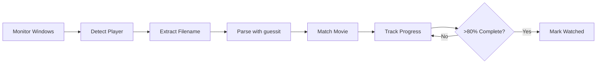

# 🎬 Simkl Scrobbler

[](https://www.python.org/downloads/)
[](https://opensource.org/licenses/MIT)
[](https://www.microsoft.com/windows)
[](CONTRIBUTING.md)
[]()

A powerful Windows-based automatic scrobbler for [Simkl](https://simkl.com) that seamlessly tracks your movie watching progress across multiple media players. Zero configuration required - it just works!

<div align="center">
  
  <br/>
  <em>Inspired by <a href="https://github.com/iamkroot/trakt-scrobbler/">iamkroot's Trakt Scrobbler</a></em>
</div>

## 📋 Table of Contents

- [Quick Start](#-quick-start)
- [Features](#-features)
- [Supported Media Players](#-supported-media-players)
- [Installation](#-installation)
- [Usage](#-usage)
- [Advanced Configuration](#️-advanced-configuration)
- [How It Works](#-how-it-works)
- [Testing](#-testing)
- [Troubleshooting](#-troubleshooting)
- [License](#-license)
- [Acknowledgments](#-acknowledgments)
- [Contributing](#-contributing)
- [Roadmap](#-roadmap)

## ⚡ Quick Start

```bash
# Install with pipx (recommended)
pipx install simkl-movie-tracker

# Initialize the tracker
simkl-tracker init

# Start tracking your movies
simkl-tracker start
```

## 🚀 Features

- **Zero Configuration** - Works with most Windows media players out of the box
- **Smart Detection** - Intelligent movie recognition using guessit library
- **Background Operation** - Runs silently in the background without a GUI
- **Progress Tracking** - Monitors viewing progress across sessions
- **Automatic Scrobbling** - Marks movies as watched after 80% completion
- **Offline Support** - Maintains sync backlog when offline
- **Resource Efficient** - Minimal CPU and memory footprint
- **Runtime Detection** - Uses actual movie runtime from Simkl API
- **Multi-Window Monitoring** - Can detect and track movies even in non-active windows
- **Enhanced Position Tracking** - Monitors actual player position for better completion detection
- **Comprehensive Logging** - Detailed playback events for debugging and analysis

## 🎥 Supported Media Players

The following media players are supported on Windows:

| Media Player | Support Status | Position Detection |
|-------------|----------------|-------------------|
| VLC Media Player | ✅ Fully Supported | ✅ (with web interface) |
| MPC-HC/BE | ✅ Fully Supported | ✅ (with web interface) |
| Windows Media Player | ✅ Fully Supported | ⚠️ Title only |
| MPV Player | ✅ Fully Supported | ⚠️ Title only |
| PotPlayer | ✅ Fully Supported | ⚠️ Title only |
| SMPlayer | ✅ Fully Supported | ⚠️ Title only |
| KMPlayer | ✅ Fully Supported | ⚠️ Title only |
| GOM Player | ✅ Fully Supported | ⚠️ Title only |

The scrobbler monitors the window titles of these players to detect media files currently being played. For VLC and MPC-HC/BE with web interfaces enabled, it can also get precise playback position information.

## 📥 Installation

### Installation Steps

1. **Ensure you have Python 3.7 or higher installed, and in your system PATH.**

   Check by running:
   ```
   python --version
   ```

2. **Ensure pip is installed.**

   Check by running:
   ```
   pip --version
   ```

3. **Install pipx:**

   **Windows:**
   ```
   python -m pip install --user pipx
   python -m pipx ensurepath
   ```
   (You may need to restart your terminal or system after this step)
   
4. **Install SIMKL Movie Tracker:**
   ```
   pipx install simkl-movie-tracker
   ```
   You will now have the `simkl-tracker` command available!

5. **Initialize SIMKL Movie Tracker:**
   ```
   simkl-tracker init
   ```
   You will be prompted to:
   - Copy you Generated Pin
   - Enter your SIMKL at Pin (https://simkl.com/pin/)
   - Authorize the app to access the SIMKL API by following the on-screen instructions

6. **Start tracking your movies:**
   ```
   simkl-tracker start
   ```

### Installing as a Windows Service (Optional)

To have SIMKL Movie Tracker start automatically with Windows:

```
simkl-tracker install-service
```

Follow the on-screen instructions to complete the service installation.

### Manual Installation (Development)

If you want to install from source:

```bash
# Clone repository
git clone https://github.com/kavinthangavel/simkl-movie-tracker.git
cd simkl-movie-tracker

# Install the package in development mode
pip install -e .

# Initialize and run
simkl-tracker init
simkl-tracker start
```

## 🎮 Usage

The tracker runs silently in the background, automatically detecting and tracking movie playback in supported media players. Basic commands:

```bash
# Initialize the tracker (first-time setup)
simkl-tracker init

# Start tracking in the foreground
simkl-tracker start

# Install as a Windows service
simkl-tracker install-service

# Show help
simkl-tracker --help
```

### Monitoring and Logs

```bash
# Monitor log file
type simkl_tracker.log

# Check detailed playback events
type simkl_scrobbler\playback_log.jsonl
```

## ⚙️ Advanced Configuration

Key settings in `media_tracker.py`:
```python
DEFAULT_POLL_INTERVAL = 10  # Player check interval (seconds)
COMPLETION_THRESHOLD = 80   # Mark as watched threshold (percent)
VIDEO_PLAYER_EXECUTABLES = ['vlc.exe', 'mpc-hc64.exe', ...] # Supported players
```

### Player Web Interface Setup (for position tracking)

For enhanced position tracking with VLC and MPC-HC/BE:

**VLC Media Player:**
1. Go to Tools > Preferences
2. Select "All" settings mode (bottom left)
3. Navigate to Interface > Main interfaces
4. Check "Web" option


**MPC-HC/BE:**
1. Go to View > Options > Player > Web Interface
2. Check "Listen on port:" (default 13579)


## 🔍 How It Works



1. **Window Detection**: Uses Windows API to monitor active and non-active windows for supported media players
2. **Title Extraction**: Parses window title for filename/movie info
3. **Smart Parsing**: Uses guessit library to intelligently extract movie title and year
4. **Movie Matching**: Queries Simkl API to identify the movie
5. **Progress Tracking**: Monitors playback position directly from player (when available) or estimates based on time
6. **Auto-marking**: Updates Simkl when 80% threshold reached
7. **Offline Handling**: Queues failed updates in backlog for future retry

## 🧪 Testing

Simkl Movie Tracker includes a comprehensive test suite to ensure reliability and functionality:

```bash
# Run the full test suite with mock API responses
python tests/master_test.py --test-mode

# Run specific test categories
python tests/master_test.py --test-mode --skip-api-errors --skip-offline

# Run tests with a real video file
python tests/master_test.py --test-mode --test-real-playback --video-file "path/to/movie.mp4"

# Get test help and options
python tests/master_test.py --help
```

### Test Suite Features:

- **Interactive Visual Output**: Modern colorized terminal display with progress bars and structured results
- **API Integration Tests**: Verifies Simkl API interactions work correctly
- **Error Handling Tests**: Ensures graceful handling of API and network failures
- **Offline Mode Testing**: Validates offline tracking and backlog sync capabilities
- **Movie Completion Tests**: Confirms proper threshold detection and marking behavior
- **Cache and Parsing Tests**: Validates movie title extraction from window titles
- **Media Player Interface Tests**: Verifies connectivity with player web interfaces
- **Real Playback Tests**: End-to-end testing with actual media player launch
- **Comprehensive Results**: Summary of all tests with timing and detailed error reporting
- **Export to JSON**: Test results saved to `test_results.json` for analysis

### Test Command Options:

| Option | Description |
|--------|-------------|
| `--test-mode` | Run with mock API responses (no actual API calls) |
| `--movie-title TITLE` | Test with specific movie title |
| `--video-file PATH` | Path to video file for real playback testing |
| `--test-real-playback` | Run real playback test with media player |
| `--skip-api` | Skip API integration tests |
| `--skip-api-errors` | Skip API error handling tests |
| `--skip-offline` | Skip offline tracking tests |
| `--skip-completion` | Skip movie completion tests |
| `--skip-cache` | Skip cache functionality tests |
| `--skip-title-parsing` | Skip title parsing tests |
| `--verbose` | Show more detailed test information |
| `--show-version` | Show test suite version and exit |

The master test suite automatically discovers and configures media players installed on your system, and sets up their web interfaces for enhanced position tracking when available.

## 🔧 Troubleshooting

### Common Issues

| Issue | Solution |
|-------|----------|
| Movie not detected | Ensure media player shows filename in window title |
| No auto-marking | Check `simkl_tracker.log` for API errors |
| Incorrect movie | Include year in filename: "Movie (2023).mp4" |
| Player not detected | Verify player is in supported list |
| Windows permission error | Run as administrator |
| Movie title parsing failed | Use standard naming: "Movie.Name.2023.mp4" |
| Position tracking not working | Enable web interface in VLC or MPC-HC/BE |
| Test fails to connect to MPC-HC | Restart MPC-HC after enabling web interface settings |
| Test output has encoding issues | Make sure terminal supports UTF-8 encoding |

### Logs and Debugging
```bash
# Check main application log
type simkl_tracker.log

# Check detailed playback events
type simkl_scrobbler\playback_log.jsonl

# Run tests with verbose output
python tests/master_test.py --test-mode --verbose
```

### Diagnostic Commands

If you're having issues, these commands can help diagnose problems:

```bash
# Check Python version
python --version

# Verify installed dependencies
pip list | findstr "requests pygetwindow guessit python-dotenv pywin32 psutil pytest colorama"

# Check network connectivity to Simkl API
curl -I https://api.simkl.com/

# List running media player processes
tasklist | findstr "vlc mpc wmplayer"
```

<!-- ## 📊 Screenshots

<div align="center">
  <p><strong>Test Suite Output</strong> - Modern colorized output with progress bar</p>
  
  
  <p><strong>Media Player Detection</strong> - Automatic player discovery and configuration</p>
  
</div> -->

## 📄 License

This project is licensed under the MIT License - see the [LICENSE](LICENSE) file for details.

## 👏 Acknowledgments

- [Simkl](https://simkl.com) for their excellent API
- [iamkroot's Trakt Scrobbler](https://github.com/iamkroot/trakt-scrobbler/) for inspiration
- [guessit](https://github.com/guessit-io/guessit) for powerful video filename parsing
<!-- - All [contributors](https://github.com/kavinthangavel/simkl-movie-tracker/graphs/contributors) -->

## 🤝 Contributing

Contributions are welcome! Please feel free to submit a Pull Request.

1. Fork the repository
2. Create your feature branch: `git checkout -b feature/amazing-feature`
3. Commit your changes: `git commit -m 'Add amazing feature'`
4. Push to the branch: `git push origin feature/amazing-feature`
5. Open a Pull Request

## 📝 Roadmap

- [ ] Add Linux support
- [ ] Add macOS support
- [ ] Create native Windows installer
- [x] Add real-time position tracking for supported players
- [x] Implement multi-window monitoring
- [x] Create automated playback tests
- [x] Enhance test suite with visual output and comprehensive coverage
- [ ] Add support for more media players
- [ ] Create GUI configuration tool

