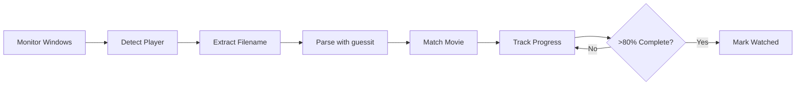

# 🎬 Simkl Movie Tracker

[](https://www.python.org/downloads/)
[](https://opensource.org/licenses/MIT)
[](https://www.microsoft.com/windows)
[](CONTRIBUTING.md)

A powerful Windows-based automatic scrobbler for [Simkl](https://simkl.com) that seamlessly tracks your movie watching progress across multiple media players. Zero configuration required - it just works!

<div align="center">
  
  <br/>
  <em>Inspired by <a href="https://github.com/iamkroot/trakt-scrobbler/">iamkroot's Trakt Scrobbler</a></em>
</div>

## ⚡ Quick Start

```bash
# Clone repository
git clone https://github.com/kavinthangavel/simkl-movie-tracker.git
cd simkl-movie-tracker

# Install dependencies
pip install -r requirements.txt

# Set up your Simkl credentials in .env file
cp .env.example .env
# Edit .env with your credentials

# Run in system tray mode (Windows)
pythonw tray_app.py
```

## 🚀 Features

- **Zero Configuration** - Works with most Windows media players out of the box
- **Smart Detection** - Intelligent movie recognition using guessit library
- **Background Operation** - Silent system tray interface with status notifications
- **Progress Tracking** - Monitors viewing progress across sessions
- **Automatic Scrobbling** - Marks movies as watched after 80% completion
- **Offline Support** - Maintains sync backlog when offline
- **Resource Efficient** - Minimal CPU and memory footprint
- **Runtime Detection** - Uses actual movie runtime from Simkl API

## 🎥 Supported Media Players

The following media players are supported on Windows:

| Media Player | Support Status |
|-------------|----------------|
| VLC Media Player | ✅ Fully Supported |
| MPC-HC/BE | ✅ Fully Supported |
| Windows Media Player | ✅ Fully Supported |
| MPV Player | ✅ Fully Supported |
| PotPlayer | ✅ Fully Supported |
| SMPlayer | ✅ Fully Supported |
| KMPlayer | ✅ Fully Supported |
| GOM Player | ✅ Fully Supported |

The scrobbler monitors the window titles of these players to detect media files currently being played.

## 🛠️ Setup Guide

### System Requirements

- Windows 7/8/10/11
- Python 3.7 or higher
- Simkl account and API credentials

### Required Dependencies

```txt
requests>=2.25.0
pygetwindow      # For Windows window detection
pywin32>=300     # For Windows API integration
guessit         # For intelligent movie name parsing
python-dotenv   # For configuration
psutil          # For process monitoring
PySimpleGUIQt   # For system tray interface
```

### Detailed Installation

1. **Get Simkl API Credentials:**
   - Create a [Simkl](https://simkl.com) account
   - Go to [Settings > Developer](https://simkl.com/settings/dev)
   - Create new client to get your Client ID
   - First run will guide you through access token generation

2. **Configure Environment:**
   ```bash
   # Copy example environment file
   cp .env.example .env
   
   # Add your credentials to .env:
   SIMKL_CLIENT_ID=your_client_id
   SIMKL_ACCESS_TOKEN=your_access_token
   ```

3. **Run the Application:**
   ```bash
   # Console mode (for testing)
   python main.py
   
   # System tray mode (recommended)
   pythonw tray_app.py  # Runs without console window
   ```

### Auto-Start Setup

To have the tracker start automatically with Windows:

1. Press `Win+R` and type `shell:startup`
2. Create a shortcut with these properties:
   ```
   Target: pythonw.exe "path\to\tray_app.py"
   Start in: path\to\simkl-movie-tracker
   ```

## 🎮 Usage

The tracker runs silently in your system tray, automatically detecting and tracking movie playback in supported media players. For testing:

```bash
# Test with specific movie
python test_movie_completion.py -t "Movie Title"

# Monitor log file
type simkl_tracker.log
```

## ⚙️ Advanced Configuration

Key settings in `media_tracker.py`:
```python
DEFAULT_POLL_INTERVAL = 10  # Player check interval (seconds)
COMPLETION_THRESHOLD = 0.80  # Mark as watched threshold
VIDEO_EXTENSIONS = ['.mp4', '.mkv', '.avi', ...]
```

## 🔍 How It Works



1. **Window Detection**: Uses Windows API to monitor active windows for supported media players
2. **Title Extraction**: Parses window title for filename/movie info
3. **Smart Parsing**: Uses guessit library to intelligently extract movie title and year
4. **Movie Matching**: Queries Simkl API to identify the movie
5. **Progress Tracking**: Monitors playback position
6. **Auto-marking**: Updates Simkl when 80% threshold reached

## 🔧 Troubleshooting

### Common Issues

| Issue | Solution |
|-------|----------|
| Movie not detected | Ensure media player shows filename in window title |
| No auto-marking | Check `simkl_tracker.log` for API errors |
| Incorrect movie | Include year in filename: "Movie (2023).mp4" |
| Tray icon missing | Run `pip install PySimpleGUIQt --upgrade` |
| Player not detected | Verify player is in supported list |
| Windows permission error | Run as administrator |
| Movie title parsing failed | Use standard naming: "Movie.Name.2023.mp4" |

### Debug Mode
```bash
# Enable debug logging
python main.py --debug
```

## 📄 License

This project is licensed under the MIT License - see the [LICENSE](LICENSE) file for details.

## 👏 Acknowledgments

- [Simkl](https://simkl.com) for their excellent API
- [iamkroot's Trakt Scrobbler](https://github.com/iamkroot/trakt-scrobbler/) for inspiration
- [guessit](https://github.com/guessit-io/guessit) for powerful video filename parsing
- PySimpleGUIQt for the system tray interface
<!-- - All [contributors](https://github.com/kavinthangavel/simkl-movie-tracker/graphs/contributors) -->

## 🤝 Contributing

Contributions are welcome! Please feel free to submit a Pull Request.

1. Fork the repository
2. Create your feature branch: `git checkout -b feature/amazing-feature`
3. Commit your changes: `git commit -m 'Add amazing feature'`
4. Push to the branch: `git push origin feature/amazing-feature`
5. Open a Pull Request

## 📝 Todo

- [ ] Add Linux support
- [ ] Add macOS support
- [ ] Create native Windows installer
- [ ] Add GUI for configuration
- [ ] Create automated tests
