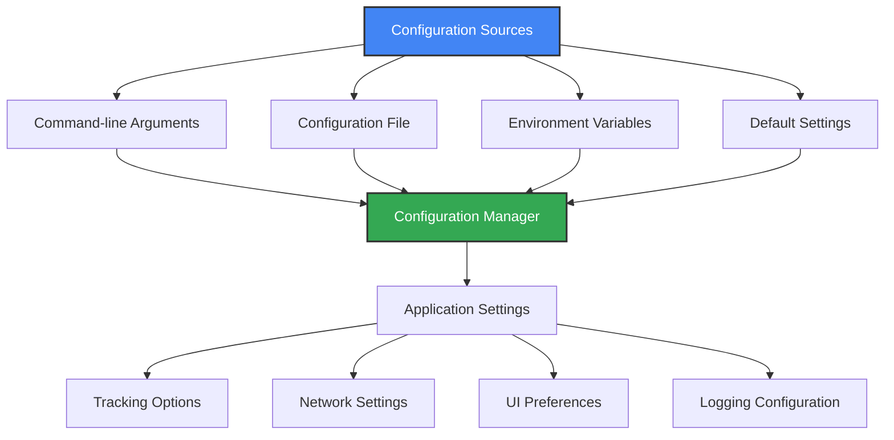

# ⚙️ Advanced Configuration

This guide explains how to customize MPS for SIMKL using config files, environment variables, and command-line options.

## 🗂️ Configuration Layers

Settings are applied in this order (highest to lowest priority):
1. Command-line arguments
2. Configuration file
3. Environment variables
4. Defaults



---

## 📁 Configuration Locations

| Platform | Config File Location |
|----------|---------------------|
| Windows  | `%APPDATA%\kavinthangavel\simkl-mps\.simkl_mps.env` |
| macOS    | `~/Library/Application Support/kavinthangavel/simkl-mps/.simkl_mps.env` |
| Linux    | `~/.local/share/kavinthangavel/simkl-mps/.simkl_mps.env` |

---

## 🔧 Settings Reference

### Core Settings
| Setting      | CLI Option         | Env Var                | Default      | Description                  |
|--------------|--------------------|------------------------|--------------|------------------------------|
| Auth Token   | `--token TOKEN`    | `SIMKL_ACCESS_TOKEN`   | Auto         | SIMKL authentication token   |
| Client ID    | `--client-id ID`   | `SIMKL_CLIENT_ID`      | Built-in     | SIMKL API client ID          |
| Data Dir     | `--data-dir PATH`  | `SIMKL_DATA_DIR`       | Platform dir | Custom data location         |

### Media Tracking
| Setting         | CLI Option           | Env Var                      | Default | Description                  |
|-----------------|---------------------|------------------------------|---------|------------------------------|
| Poll Interval   | `--interval SECONDS`| `SIMKL_POLL_INTERVAL`        | 10      | Window check frequency (sec) |
| Completion %    | `--threshold PERCENT`| `SIMKL_COMPLETION_THRESHOLD` | 80      | % watched to mark complete   |
| Offline Mode    | `--offline`         | `SIMKL_OFFLINE_MODE`         | false   | Force offline operation      |
| Auto Process    | `--auto-process`    | `SIMKL_AUTO_PROCESS_BACKLOG` | true    | Process backlog on connect   |


### Logging
| Setting   | CLI Option         | Env Var           | Default | Description                  |
|-----------|-------------------|-------------------|---------|------------------------------|
| Log Level | `--log-level`     | `SIMKL_LOG_LEVEL` | INFO    | `DEBUG`, `INFO`, etc.        |
| Log File  | `--log-file PATH` | `SIMKL_LOG_FILE`  | Auto    | Custom log file location     |

---

## 📝 Example Configuration File

```ini
# .simkl_mps.env
SIMKL_ACCESS_TOKEN=your_access_token_here

```

---

## 🛠️ Advanced Customization

### Media Player Settings
```ini
# VLC
SIMKL_VLC_PORT=8080
SIMKL_VLC_PASSWORD=simkl
# MPV
SIMKL_MPV_SOCKET_PATH=/custom/path/to/mpvsocket
# MPC-HC
SIMKL_MPC_PORT=13579
```

### Title Detection
```ini
SIMKL_TITLE_REGEX=(?i)(.+?)(?:\W\d{4}\W|\W\(\d{4}\)|\W\d{4}$|$)
SIMKL_MATCH_CONFIDENCE=0.7
```

### Network
```ini
SIMKL_HTTP_PROXY=http://your-proxy-server:port
SIMKL_HTTPS_PROXY=https://your-proxy-server:port
SIMKL_CONNECTION_TIMEOUT=10
```

---

## 🧩 Configuration Methods

- **Command Line:**
  ```bash
  simkl-mps start --interval 5 --threshold 85 --log-level DEBUG
  ```
- **Config File:** Edit `.simkl_mps.env` in your data directory

---

## 🚀 Optimization & Debugging

- Enable debug logging: `simkl-mps start --log-level DEBUG`
- Set custom log file: `simkl-mps start --log-file ~/simkl-debug.log`
- Use descriptive filenames for best detection
- Increase poll interval for lower resource use

---

