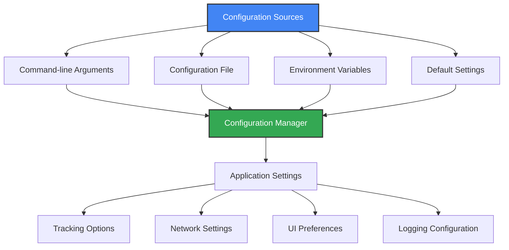

# ⚙️ Advanced Configuration

This document provides detailed configuration options for MPS for SIMKL to customize your experience.

## 📁 Configuration Overview

MPS for SIMKL uses a flexible configuration system with multiple layers in the following priority order:

1. Command-line arguments (highest priority)
2. Configuration file settings
3. Environment variables 
4. Default settings (lowest priority)



## 🔧 Configuration Locations

### Main Configuration File

The application stores its primary configuration in `.simkl_mps.env`:

| Platform | Default Location |
|----------|------------------|
| Windows | `%APPDATA%\kavinthangavel\simkl-mps\.simkl_mps.env` |
| macOS | `~/Library/Application Support/kavinthangavel/simkl-mps/.simkl_mps.env` |
| Linux | `~/.local/share/kavinthangavel/simkl-mps/.simkl_mps.env` |

### Important Data Files

| File | Purpose | Location |
|------|---------|----------|
| `simkl_mps.log` | Main application log | Same directory as config |
| `playback_log.jsonl` | Detailed media events | Same directory as config |
| `media_cache.json` | Media metadata cache | Same directory as config |
| `backlog.json` | Offline queue | Same directory as config |

## ⚙️ Configuration Options

### Core Settings

| Setting | Command Line | Env Variable | Default | Description |
|---------|--------------|--------------|---------|-------------|
| Auth Token | `--token TOKEN` | `SIMKL_ACCESS_TOKEN` | Auto-generated | Your Simkl authentication token |
| Client ID | `--client-id ID` | `SIMKL_CLIENT_ID` | Built-in ID | Simkl API client ID |
| Data Directory | `--data-dir PATH` | `SIMKL_DATA_DIR` | Platform default | Custom location for data files |

### Media Tracking

| Setting | Command Line | Env Variable | Default | Description |
|---------|--------------|--------------|---------|-------------|
| Poll Interval | `--interval SECONDS` | `SIMKL_POLL_INTERVAL` | `10` | Window check frequency in seconds |
| Completion % | `--threshold PERCENT` | `SIMKL_COMPLETION_THRESHOLD` | `80` | Percentage to mark as watched |
| Offline Mode | `--offline` | `SIMKL_OFFLINE_MODE` | `false` | Force offline operation |
| Auto Process | `--auto-process` | `SIMKL_AUTO_PROCESS_BACKLOG` | `true` | Process backlog after reconnecting |

### Notifications

| Setting | Command Line | Env Variable | Default | Description |
|---------|--------------|--------------|---------|-------------|
| Disable Notifications | `--no-notify` | `SIMKL_NO_NOTIFICATIONS` | `false` | Turn off desktop notifications |
| Notification Level | `--notify-level LEVEL` | `SIMKL_NOTIFY_LEVEL` | `normal` | Set verbosity (`minimal`, `normal`, `verbose`) |

### Logging

| Setting | Command Line | Env Variable | Default | Description |
|---------|--------------|--------------|---------|-------------|
| Log Level | `--log-level LEVEL` | `SIMKL_LOG_LEVEL` | `INFO` | Set verbosity (`DEBUG`, `INFO`, `WARNING`, `ERROR`) |
| Log File | `--log-file PATH` | `SIMKL_LOG_FILE` | Auto-generated | Custom log file location |

## 📝 Example Configuration File

Here's a sample `.simkl_mps.env` file with common customizations:

```ini
# Authentication (do not edit manually unless you know what you're doing)
SIMKL_ACCESS_TOKEN=your_access_token_here

# Tracking settings
SIMKL_POLL_INTERVAL=5
SIMKL_COMPLETION_THRESHOLD=85

# Logging
SIMKL_LOG_LEVEL=INFO

# Notification settings
SIMKL_NO_NOTIFICATIONS=false
SIMKL_NOTIFY_LEVEL=normal
```

## 🔍 Advanced Customization

### Media Player Settings

Fine-tune how MPS for SIMKL interacts with specific media players:

```ini
# VLC specific settings
SIMKL_VLC_PORT=8080
SIMKL_VLC_PASSWORD=simkl

# MPV specific settings
SIMKL_MPV_SOCKET_PATH=/custom/path/to/mpvsocket

# MPC-HC specific settings
SIMKL_MPC_PORT=13579
```

### Title Detection

Customize how media titles are extracted from filenames:

```ini
# Custom regex pattern for title extraction
SIMKL_TITLE_REGEX=(?i)(.+?)(?:\W\d{4}\W|\W\(\d{4}\)|\W\d{4}$|$)

# Minimum match confidence threshold (0.0-1.0)
SIMKL_MATCH_CONFIDENCE=0.7
```

### Network Configuration

If you need to use a proxy for connecting to the SIMKL API:

```ini
# HTTP/HTTPS proxy settings
SIMKL_HTTP_PROXY=http://your-proxy-server:port
SIMKL_HTTPS_PROXY=https://your-proxy-server:port

# Connection timeout in seconds
SIMKL_CONNECTION_TIMEOUT=10
```

## 🔄 Configuration Methods

### Command Line

Apply settings for a single session:

```bash
simkl-mps start --interval 5 --threshold 85 --log-level DEBUG
```

### Configuration File

For persistent settings, edit `.simkl_mps.env` in your application data directory.

### Environment Variables

Set environment variables before running the application:

```bash
# Linux/macOS
export SIMKL_POLL_INTERVAL=5
export SIMKL_LOG_LEVEL=DEBUG
simkl-mps start

# Windows (CMD)
set SIMKL_POLL_INTERVAL=5
set SIMKL_LOG_LEVEL=DEBUG
simkl-mps start

# Windows (PowerShell)
$env:SIMKL_POLL_INTERVAL=5
$env:SIMKL_LOG_LEVEL=DEBUG
simkl-mps start
```

## 🛠️ Optimization Tips

### Debugging Issues

For troubleshooting:

```bash
# Enable verbose logging
simkl-mps start --log-level DEBUG

# Set custom log file location
simkl-mps start --log-file ~/simkl-debug.log
```

### Improving Media Detection

For better recognition:

1. Configure advanced tracking for your media players (see [Media Players](media-players.md))
2. Use descriptive filenames: `Movie Title (2023).mp4`
3. Lower the poll interval: `--interval 5`

### Performance Optimization

For reduced resource usage:

1. Increase poll interval: `--interval 20`
2. Enable minimal cache: `--minimal-cache`
3. Clean old data regularly: `simkl-mps clean`

## 🔄 Resetting Configuration

If you need to start fresh:

```bash
# Complete reset
simkl-mps reset

# Manual deletion (alternative method)
# Windows:
# Delete %APPDATA%\kavinthangavel\simkl-mps\
# macOS/Linux:
# Delete ~/.local/share/kavinthangavel/simkl-mps/
```

After resetting, run `simkl-mps init` to reconfigure.
