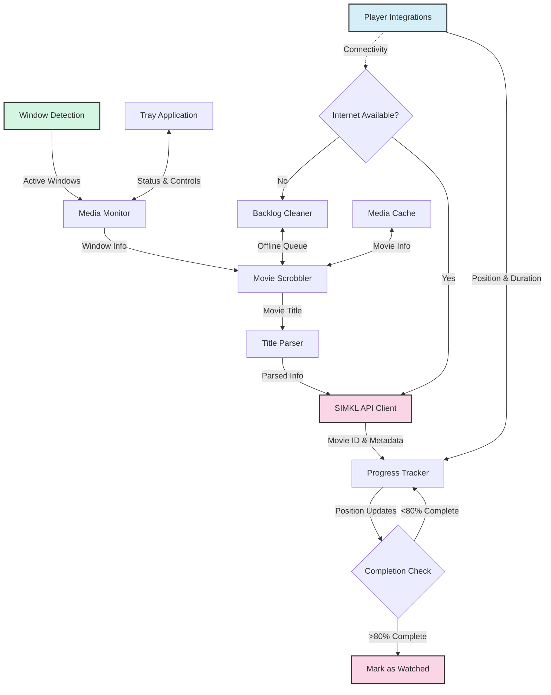

# ⚙️ Advanced & Developer Guide

This guide combines advanced configuration and developer documentation for MPS for SIMKL.

## 🛠️ Advanced Configuration

Settings can be customized via config files, environment variables, or command-line options. See the [Media Players Guide](media-players.md) for player-specific settings.


### Config File Locations

| Platform | Config File Location |
|----------|---------------------|
| Windows  | `%APPDATA%\kavinthangavel\simkl-mps\.simkl_mps.env` |
| macOS    | `~/Library/Application Support/kavinthangavel/simkl-mps/.simkl_mps.env` |
| Linux    | `~/.local/share/kavinthangavel/simkl-mps/.simkl_mps.env` |

### Example Settings

```ini
# .simkl_mps.env
SIMKL_ACCESS_TOKEN=your_access_token_here
USER_ID=your_user_id
```

See [Media Players Guide](media-players.md) for player-specific environment variables.

---

## 👩‍💻 Developer Guide

### Project Structure

```
simkl-movie-tracker/
  docs/                # Documentation
  simkl_mps/           # Main package
    players/           # Media player integrations
    utils/             # Utility functions
  pyproject.toml       # Project metadata
  README.md            # Project overview
  LICENSE              # License info
```

### Setup & Environment

```bash
git clone https://github.com/kavinthangavel/Media-Player-Scrobbler-for-Simkl.git
cd Media-Player-Scrobbler-for-Simkl
poetry install --with dev
# or
pip install -e ".[dev]"
```

### Adding a New Media Player

1. Create a new file in `players/` (e.g. `simkl_mps/players/new_player.py`)
2. Implement a class with a `get_position_duration()` method
3. Add the player to `players/__init__.py`
4. Update detection in `window_detection.py`

### Building & Publishing

```bash
poetry build
poetry publish
```

### Architecture Overview



---

For more, see the [Usage Guide](usage.md) and [Media Players Guide](media-players.md).

