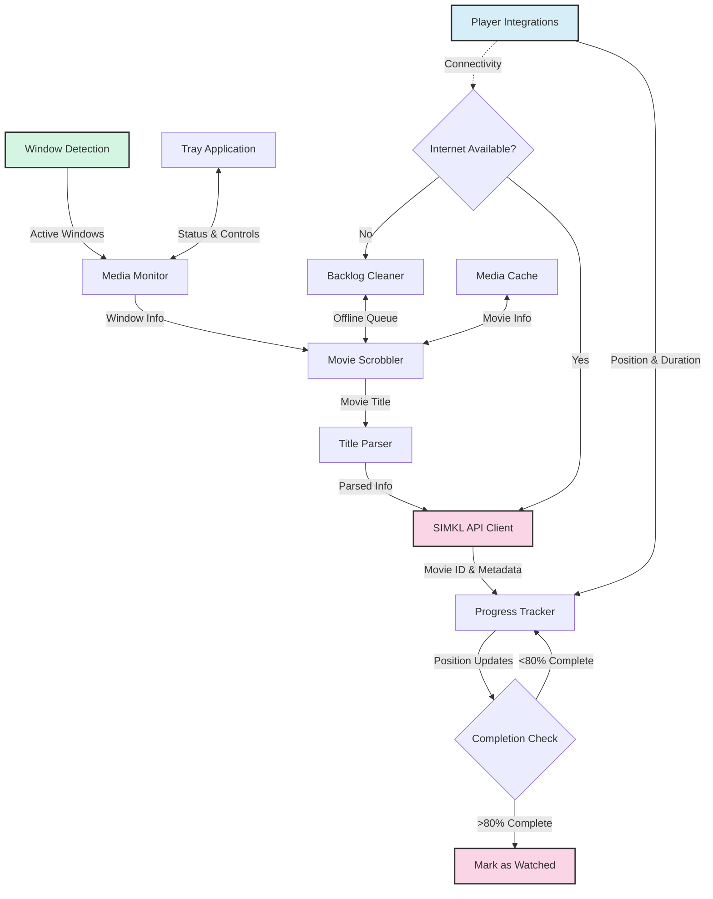
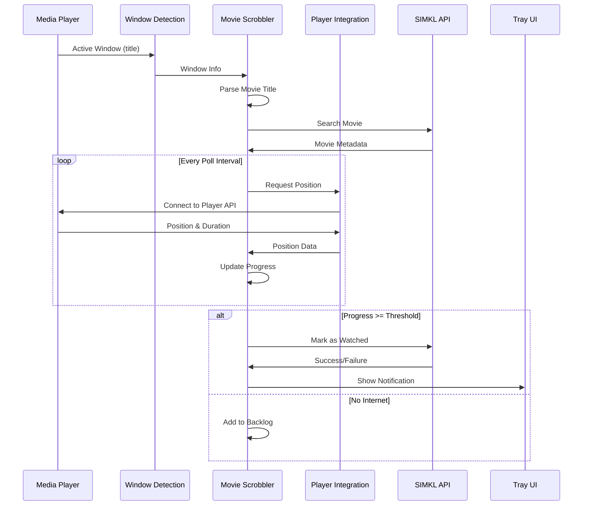
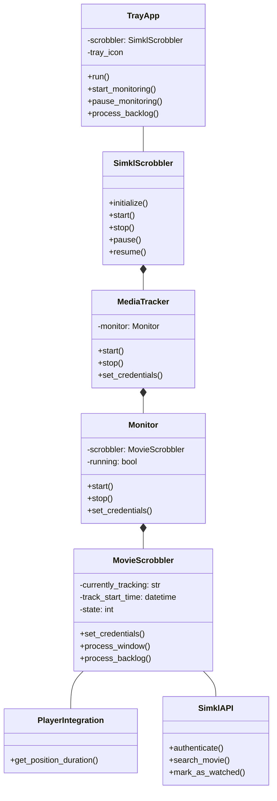
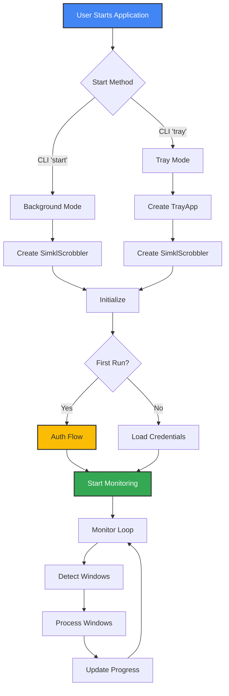
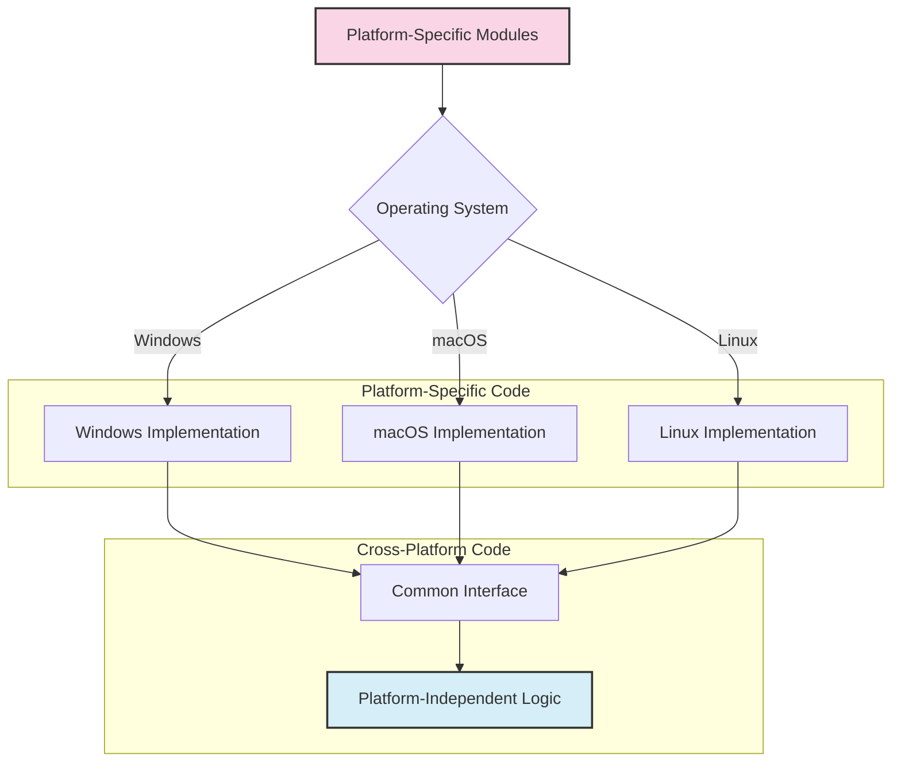

# 💻 Development Guide

This guide is for developers and contributors to Media Player Scrobbler for SIMKL.

## 📁 Project Structure

```
simkl-movie-tracker/
├── docs/                # Documentation
├── simkl_mps/           # Main package
│   ├── __init__.py
│   ├── ...
│   ├── players/         # Media player integrations
│   └── utils/           # Utility functions
├── tests/               # Test suite
├── pyproject.toml       # Project metadata
├── README.md            # Project overview
└── LICENSE              # License info
```

## ⚙️ Setup & Environment

1. Clone the repo:
   ```bash
   git clone https://github.com/kavinthangavel/simkl-movie-tracker.git
   cd simkl-movie-tracker
   ```
2. Install dependencies:
   ```bash
   poetry install --with dev
   # or
   pip install -e ".[dev]"
   ```
3. (Optional) Set up pre-commit hooks:
   ```bash
   pre-commit install
   ```

<!-- ## 🧪 Testing & Code Style

- Run all tests:
  ```bash
  poetry run pytest
  ```
- Run with coverage:
  ```bash
  poetry run pytest --cov=simkl_mps
  ```
- Lint code:
  ```bash
  poetry run flake8 simkl_mps
  ``` -->

## ➕ Adding a New Media Player

1. Create a new file in `players/` (e.g. `simkl_mps/players/new_player.py`)
2. Implement a class with a `get_position_duration()` method
3. Add the player to `players/__init__.py`
4. Update detection in `window_detection.py`

## 📦 Building & Publishing

- Build:
  ```bash
  poetry build
  ```
- Publish to PyPI:
  ```bash
  poetry publish
  ```

## 🤝 Contributor Info

- Fork, branch, commit, push, and open a Pull Request
- For API access, register a client at https://simkl.com/settings/developer/
- Use `--debug` for detailed logs
- Test integrations separately if needed

---

## 🏗️ Architecture Overview

MPS for SIMKL uses a modular architecture:



### Component Roles

| Component         | File                  | Description                                 |
|------------------|-----------------------|---------------------------------------------|
| Window Detection | `window_detection.py` | OS-specific window monitoring               |
| Media Monitor    | `monitor.py`          | Coordinates detection and status tracking   |
| Movie Scrobbler  | `movie_scrobbler.py`  | Core tracking and scrobbling logic          |
| Player Integrations | `players/*.py`      | Player APIs for position tracking           |
| SIMKL API Client | `simkl_api.py`        | Auth and SIMKL communication                |
| Backlog Cleaner  | `backlog_cleaner.py`  | Offline queue management                    |
| Media Cache      | `media_cache.py`      | Local movie metadata                        |
| Tray Application | `tray_app.py`         | System tray UI                              |

---

## 🔄 Data Flow



---

## 🧩 Class Relationships



---

## 🏁 Execution Flow



---

## 🖥️ Platform Abstraction



**Key abstraction points:**
- Window detection
- System tray integration
- File system access
- Process management
- Notifications
