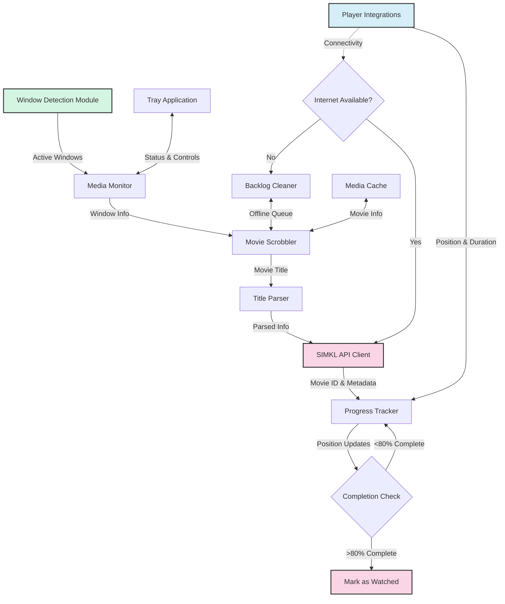
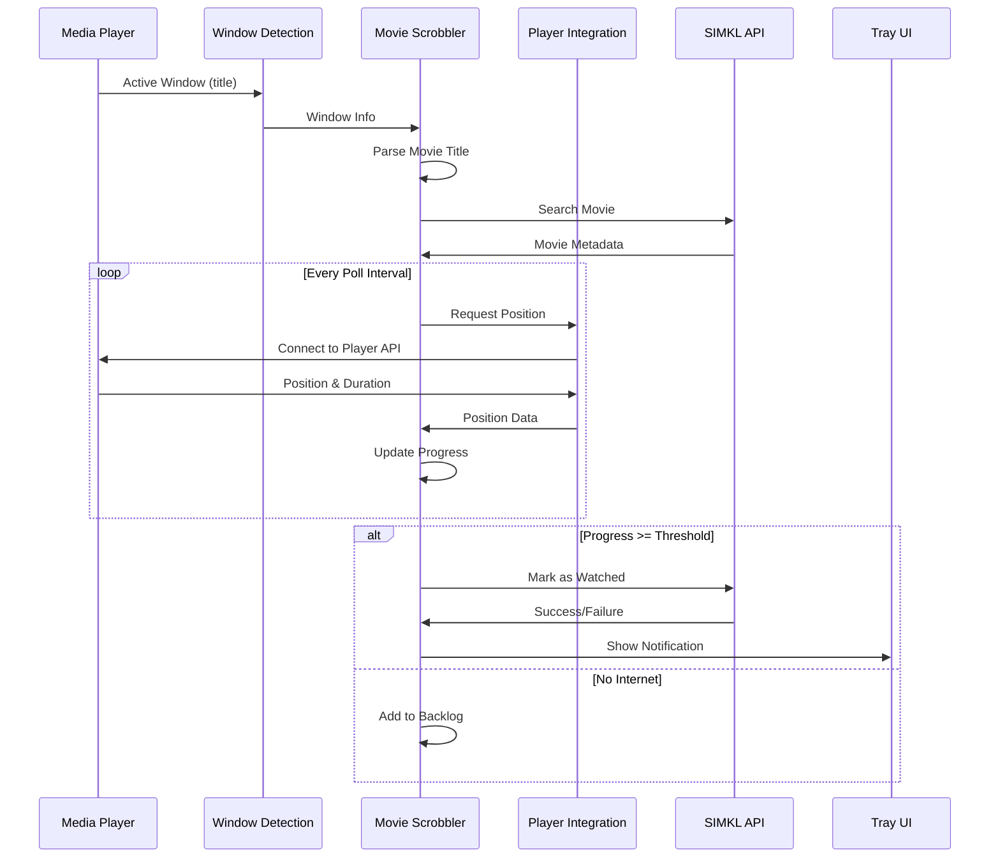
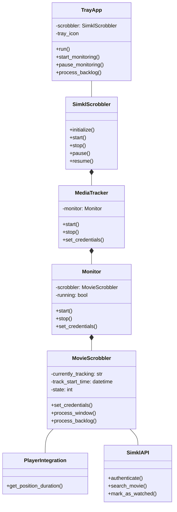
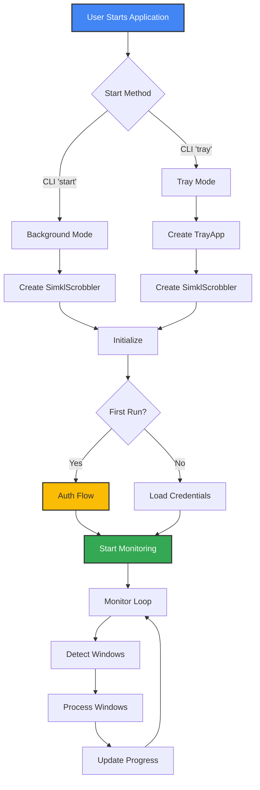
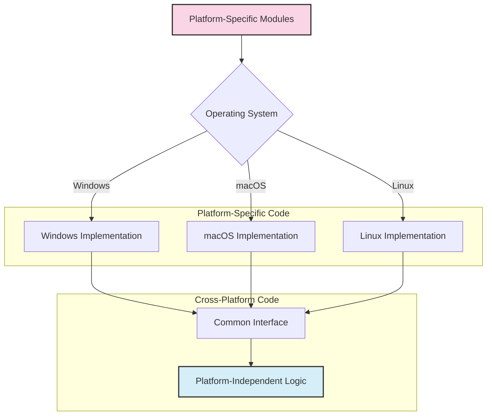

# 💻 Development Guide

This document provides information for developers who want to contribute to Media Player Scrobbler for SIMKL.

## 📂 Project Structure

```
simkl-movie-tracker/
├── docs/                    # Documentation
├── simkl_mps/         # Main package
│   ├── __init__.py          # Package initialization
│   ├── backlog_cleaner.py   # Handles offline queue
│   ├── cli.py               # Command-line interface
│   ├── main.py              # Application entry point
│   ├── media_cache.py       # Movie info caching
│   ├── media_tracker.py     # Main tracking coordination
│   ├── monitor.py           # Window monitoring
│   ├── movie_scrobbler.py   # Movie tracking and Simkl integration
│   ├── service_manager.py   # System service management
│   ├── service_runner.py    # Background service implementation
│   ├── simkl_api.py         # Simkl API interactions
│   ├── tray_app.py          # System tray application
│   ├── window_detection.py  # Cross-platform window detection
│   ├── players/             # Media player integrations
│   │   ├── __init__.py
│   │   ├── mpc.py           # MPC-HC/BE integration
│   │   ├── mpv.py           # MPV integration
│   │   ├── potplayer.py     # PotPlayer integration
│   │   └── vlc.py           # VLC integration
│   └── utils/               # Utility functions and constants
├── tests/                   # Test suite
├── .gitignore               # Git ignore patterns
├── pyproject.toml           # Project metadata and dependencies
├── README.md                # Project overview
└── LICENSE                  # License information
```

## 🚀 Development Setup

1. Clone the repository:
   ```bash
   git clone https://github.com/kavinthangavel/simkl-movie-tracker.git
   cd simkl-movie-tracker
   ```

2. Set up the development environment:
   ```bash
   # Using Poetry (recommended)
   poetry install --with dev
   
   # Or using pip
   pip install -e ".[dev]"
   ```

3. Set up pre-commit hooks (optional):
   ```bash
   pre-commit install
   ```

## 🧪 Running Tests

```bash
# Run tests with pytest
poetry run pytest

# Run tests with coverage
poetry run pytest --cov=simkl_mps

# Run specific test file
poetry run pytest tests/test_specific_file.py
```

## 📝 Code Style

This project follows PEP 8 style guidelines. Use flake8 to check your code:

```bash
poetry run flake8 simkl_mps
```

## ➕ Adding a New Media Player

To add support for a new media player:

1. Create a new file in the `players/` directory (e.g., `simkl_mps/players/new_player.py`)
2. Implement a class that follows the player integration interface:
   ```python
   class NewPlayerIntegration:
       def __init__(self):
           # Initialize player connection
           pass
           
       def get_position_duration(self, process_name=None):
           # Return (position_seconds, duration_seconds) tuple or (None, None)
           pass
   ```
3. Add the player to `players/__init__.py`
4. Update window detection to recognize the player in `window_detection.py`

## 📦 Building and Publishing

```bash
# Build distribution packages
poetry build

# Publish to PyPI (requires credentials)
poetry publish
```

## 🔄 Pull Request Process

1. Fork the repository
2. Create a feature branch: `git checkout -b feature/amazing-feature`
3. Make your changes and commit them: `git commit -m 'Add amazing feature'`
4. Push to the branch: `git push origin feature/amazing-feature`
5. Open a Pull Request against the main repository

## 🔑 API Access

For development, you can use the default client ID or register your own:

1. Go to https://simkl.com/settings/developer/
2. Create a new application
3. Set the redirect URL to `urn:ietf:wg:oauth:2.0:oob`
4. Use the client ID in your development environment:
   ```
   SIMKL_CLIENT_ID=your_client_id
   ```

## 🔍 Debugging Tips

- Use the `--debug` flag to enable detailed logging: `simkl-mps start --debug`
- Check logs in the application data directory
- Use Python's debugger (pdb) or an IDE like PyCharm or VS Code for step-by-step debugging
- Test player integration separately using the player-specific test scripts

## 🏗️ Architecture Overview

MPS for SIMKL uses a modular architecture that clearly separates responsibilities between components:



### Component Roles

| Component | File | Description |
|-----------|------|-------------|
| Window Detection | `window_detection.py` | OS-specific code to identify and monitor media player windows |
| Media Monitor | `monitor.py` | Coordinates detection and status tracking |
| Movie Scrobbler | `movie_scrobbler.py` | Core business logic for tracking and scrobbling |
| Player Integrations | `players/*.py` | Individual media player APIs for precise position tracking |
| SIMKL API Client | `simkl_api.py` | Authentication and communication with SIMKL |
| Backlog Cleaner | `backlog_cleaner.py` | Manages the offline queue system |
| Media Cache | `media_cache.py` | Local storage of movie metadata |
| Tray Application | `tray_app.py` | User interface via system tray |

## 📊 Data Flow

The following diagram illustrates how data flows through the system:



## 🧩 Class Relationships

This diagram shows the relationships between the major classes:



## 🚀 Execution Flow

When the application starts, this is the sequence of operations:



## ⚙️ Platform Abstraction

The application uses abstraction layers to provide cross-platform support:



Key abstraction points:
- Window detection
- System tray integration
- File system access
- Process management
- Notifications
