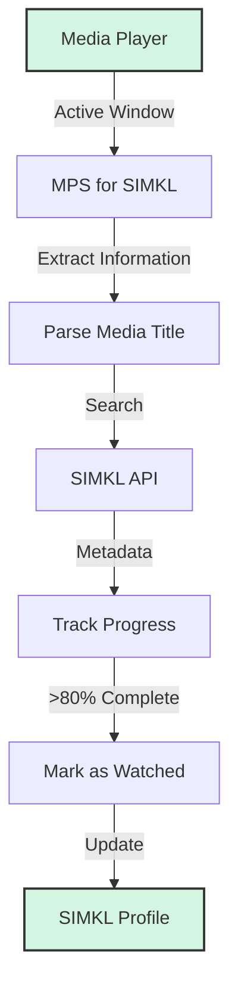

# MPS for SIMKL

[](https://github.com/kavinthangavel/media-player-scrobbler-for-simkl/blob/main/LICENSE)
[](https://pypi.org/project/simkl-mps/)
[](https://pypi.org/project/simkl-mps/)
[]()

<div align="center">
  
  <br/>
  <em>Your media, automatically tracked whenever you watch it</em>
</div>

## What is MPS for SIMKL?

MPS for SIMKL (Media Player Scrobbler for SIMKL) is an automatic scrobbler for [SIMKL](https://simkl.com) that tracks your media playback across various media players and updates your SIMKL account. The application runs silently in the background, requiring minimal setup and maintenance while ensuring your watch history stays up-to-date.

## ✨ Features

- **Automatic Tracking**: Detects when you're watching media and scrobbles it to your SIMKL account
- **Smart Media Detection**: Intelligently identifies movies and shows from filenames
- **Multiple Media Players**: Supports VLC, MPV, MPC-HC, PotPlayer, and more
- **System Tray Interface**: Convenient controls and status information
- **Cross-Platform**: Full support for Windows, macOS, and Linux
- **Offline Support**: Records your watched media when offline and syncs automatically when connection is restored
- **Position Tracking**: Monitors actual playback position for supported players
- **Auto-Update System**: Stay current with the latest features and improvements (Windows installer)

## ⚡ Quick Start

### Windows: 
Download the installer from the [Releases Page]((https://github.com/kavinthangavel/media-player-scrobbler-for-simkl/releases/latest))

### Other platforms or manual installation:
```bash
# 1. Install via pip
pip install simkl-mps

# 2. Start the application
simkl-mps start

# 3. Authenticate when prompted and enjoy automatic tracking!
```

## 📚 Documentation

For detailed information, check out the following sections:

- [Installation](installation.md): Get up and running quickly
- [Usage](usage.md): Learn how to use the application effectively
- [Media Players](media-players.md): Configure supported media players
- [Configuration](configuration.md): Advanced customization options
- [Troubleshooting](troubleshooting.md): Solutions for common issues
- [Development](development.md): Information for contributors

## 🔍 How It Works



1. **Detection**: The application monitors active windows to detect media players
2. **Identification**: Media titles are extracted and matched against the SIMKL database
3. **Tracking**: Playback position is monitored through window focus or player APIs
4. **Completion**: When you've watched enough (default: 80%), it's marked as watched
5. **Synchronization**: Your SIMKL profile is updated automatically

## 📄 License

MPS for SIMKL is licensed under the GNU GPL v3 License. See the [LICENSE](https://github.com/kavinthangavel/media-player-scrobbler-for-simkl/blob/main/LICENSE) file for details.

---

<div align="center">
  <p>Made with ❤️ by <a href="https://github.com/kavinthangavel">kavinthangavel</a></p>
  <p>
    <a href="https://github.com/kavinthangavel/media-player-scrobbler-for-simkl/stargazers">⭐ Star us on GitHub</a> •
    <a href="https://github.com/kavinthangavel/media-player-scrobbler-for-simkl/issues">🐛 Report Bug</a> •
    <a href="https://github.com/kavinthangavel/media-player-scrobbler-for-simkl/issues">✨ Request Feature</a>
  </p>
</div>