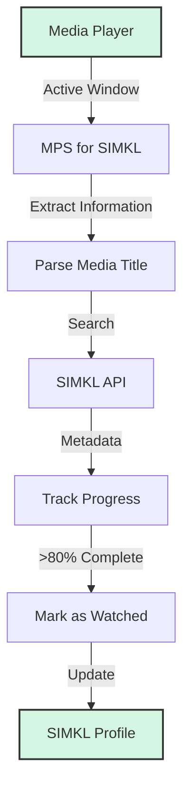

# 🎬 MPS for SIMKL

[](https://github.com/kavinthangavel/media-player-scrobbler-for-simkl/blob/main/LICENSE)
[](https://pypi.org/project/simkl-mps/)
[](https://pypi.org/project/simkl-mps/)
[]()

<div align="center">
  
  <br/>
  <em>Automatic movie tracking for all your media players</em>
</div>

## What is MPS for SIMKL?

MPS for SIMKL (Media Player Scrobbler) is a cross-platform app that automatically tracks your movie watching in popular media players and syncs your progress to your SIMKL account. It runs in the background or system tray, requires minimal setup, and supports Windows, macOS, and Linux.

## ⚡ Quick Start

- **Windows:** [Download the installer](https://github.com/kavinthangavel/media-player-scrobbler-for-simkl/releases/latest) and follow the setup wizard.

- **macOS/Linux:** [Testing in Progress]
  ```bash
  pip install simkl-mps
  simkl-mps start
  ```
- Authenticate with SIMKL when prompted.

See the [Installation Guide](installation.md) for full details.

## 📚 Documentation

- [Installation Guide](installation.md)
- [Usage Guide](usage.md)
- [Supported Media Players](media-players.md)
- [Configuration](configuration.md)
- [Troubleshooting](troubleshooting.md)
- [Development Guide](development.md)
- [Todo List](todo.md)

## 🔍 How It Works



1. **Detection:** Monitors active windows to detect media players
2. **Identification:** Extracts and matches media titles against SIMKL
3. **Tracking:** Monitors playback position
4. **Completion:** Marks as watched when threshold is reached
5. **Sync:** Updates your SIMKL profile automatically

## 🚦 Performance Notes

- **Movie identification:** 15–30 seconds (typical)
- **Mark as watched (online):** 2–8 seconds (best connection)
- **Offline scrobble:** 4–10 seconds to process title, 1–3 seconds to add to backlog after threshold

## 📝 License

MPS for SIMKL is licensed under the GNU GPL v3 License. See the [LICENSE](https://github.com/kavinthangavel/media-player-scrobbler-for-simkl/blob/main/LICENSE) file for details.

---

<div align="center">
  <p>Made with ❤️ by <a href="https://github.com/kavinthangavel">kavinthangavel</a></p>
  <p>
    <a href="https://github.com/kavinthangavel/media-player-scrobbler-for-simkl/stargazers">⭐ Star us on GitHub</a> •
    <a href="https://github.com/kavinthangavel/media-player-scrobbler-for-simkl/issues">🐞 Report Bug</a> •
    <a href="https://github.com/kavinthangavel/media-player-scrobbler-for-simkl/issues">✨ Request Feature</a>
  </p>
</div>