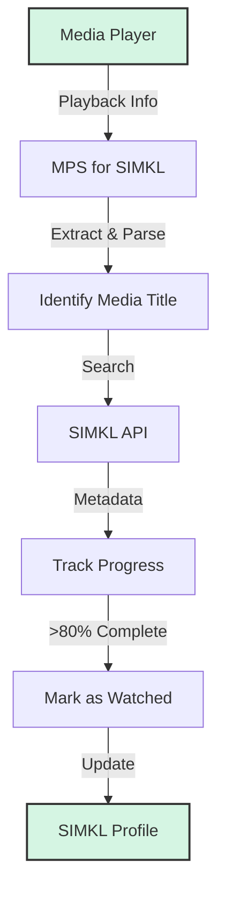

# 🎬 MPS for SIMKL

## What is MPS for SIMKL?

MPS for SIMKL (Media Player Scrobbler) is a cross-platform app that automatically tracks your movie watching in popular media players and syncs your progress to your SIMKL account. It runs in the background or system tray, requires minimal setup, and supports Windows, macOS (experimental), and Linux.

## ⚡ Quick Start

- **Windows:** Use the [Windows Guide](windows-guide.md) (EXE installer, tray app, no commands needed).
- **Linux:** Use the [Linux Guide](linux-guide.md) (pipx recommended, tray app, setup command needed).
- **macOS:** Use the [Mac Guide](mac-guide.md) (pip install, tray app, setup command needed, experimental/untested).

After installation, authenticate with SIMKL and **configure your media players** using the [Media Players Guide](media-players.md) (this step is critical for accurate tracking).

## 📚 Documentation

- [Windows Guide](windows-guide.md)
- [Linux Guide](linux-guide.md)
- [Mac Guide](mac-guide.md)
- [Supported Media Players](media-players.md)
- [Usage Guide](usage.md)
- [Advanced & Developer Guide](configuration.md)
- [Troubleshooting Guide](troubleshooting.md)
- [Todo List](todo.md)

## 🔍 How It Works

1. **Detection:** Monitors media players via window titles or player APIs.
2. **Identification:** Extracts and matches media titles against SIMKL.
3. **Tracking:** Monitors playback position (requires player configuration via [Media Players Guide](media-players.md)).
4. **Completion:** Marks as watched when the configured threshold (default 80%) is reached.
5. **Sync:** Updates your SIMKL profile automatically.

## 🚦 Performance Notes

- **Movie identification:** 15–30 seconds (typical)
- **Mark as watched (online):** 2–8 seconds (best connection)
- **Offline scrobble:** 4–10 seconds to process title, 1–3 seconds to add to backlog after threshold

## 📝 License

MPS for SIMKL is licensed under the GNU GPL v3 License. See the [LICENSE](https://github.com/kavinthangavel/media-player-scrobbler-for-simkl/blob/main/LICENSE) file for details.

---

  
Made with ❤️ by <a href="https://github.com/kavinthangavel">kavinthangavel</a>

  

    <a href="https://github.com/kavinthangavel/media-player-scrobbler-for-simkl/stargazers">⭐ Star us on GitHub</a> •
    <a href="https://github.com/kavinthangavel/media-player-scrobbler-for-simkl/issues">🐞 Report Bug</a> •
    <a href="https://github.com/kavinthangavel/media-player-scrobbler-for-simkl/issues">✨ Request Feature</a>
  

