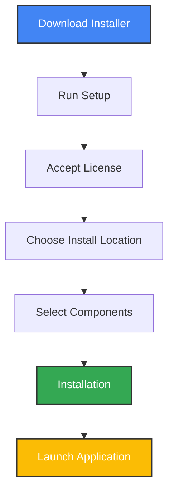

# 📥 Installation Guide

This guide explains how to install Media Player Scrobbler for SIMKL on Windows, macOS, and Linux.

## 🚀 Quick Start Table

| Platform | Recommended Method | Docs |
|----------|-------------------|------|
| Windows  | [Installer](#windows-installer) or [pip](#pip-installation) | [Usage](usage.md) |
| macOS    | [pip](#pip-installation) with macOS extras | [Usage](usage.md) |
| Linux    | [pip](#pip-installation) with Linux extras | [Usage](usage.md) |

---

## 🪟 Windows Installer

1. [Download the latest installer](https://github.com/kavinthangavel/media-player-scrobbler-for-simkl/releases/latest)
2. Run the setup wizard
3. Launch from the Start menu
4. Authenticate with SIMKL when prompted
5. The app runs in your system tray

### Installer Features
- Desktop/start menu shortcuts
- Auto-start on login (optional)
- Weekly auto-update checks (optional)
- One-click updates from tray menu

### Installation Process



### Uninstallation

1. Open **Settings → Apps → Apps & features**
2. Find "Media Player Scrobbler for SIMKL"
3. Click **Uninstall**
4. Choose whether to remove user data

---

## 🐍 Pip Installation (All Platforms)

```bash
pip install simkl-mps
simkl-mps start
```

- Authenticate with SIMKL on first run
- For advanced tracking, see [Media Players](media-players.md)

---

## 🖥️ Platform Prerequisites

<details>
<summary><b>Windows</b></summary>
No extra requirements.
</details>

<details>
<summary><b>macOS</b></summary>
Install with macOS extras:
```bash
pip install "simkl-mps[macos]"
```
</details>

<details>
<summary><b>Linux</b></summary>
Install dependencies, then:
```bash
sudo apt install python3-pip wmctrl xdotool python3-gi gir1.2-gtk-3.0 libnotify-bin
pip install "simkl-mps[linux]"
```
</details>

---

## 🛠️ Post-Installation

- App starts automatically (if selected)
- Tray icon appears
- Authenticate with SIMKL (first run)
- App begins monitoring media players

---

## ✅ Verifying Installation

```bash
simkl-mps --version
```

You should see the installed version number.

For more, see the [Usage Guide](usage.md).

## 🚦 Performance Notes

- **Movie identification:** 15–30 seconds (typical)
- **Mark as watched (online):** 2–8 seconds (best connection)
- **Offline scrobble:** 4–10 seconds to process title, 1–3 seconds to add to backlog after threshold
