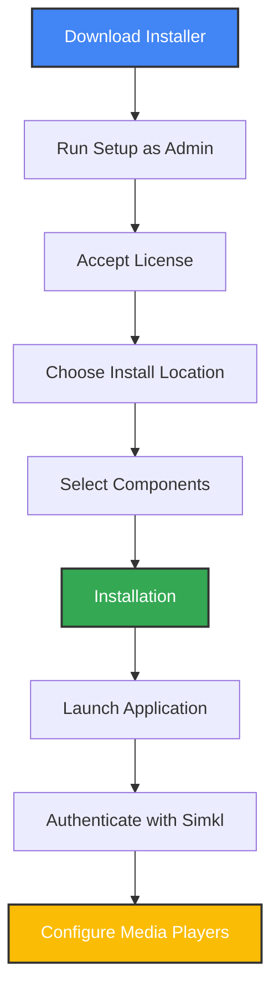

# 📥 Installation Guide

This comprehensive guide explains how to install Media Player Scrobbler for SIMKL on Windows, macOS, and Linux, with detailed platform-specific instructions.

## 🚀 Quick Start Table

| Platform | Recommended Method | Docs |
|----------|-------------------|------|
| Windows  | [Installer](#windows-installer) (recommended) or [pip](#pip-installation) | [Usage](usage.md) |
| macOS    | [pip](#pip-installation) with macOS extras | [Usage](usage.md) |
| Linux    | [pip](#pip-installation) with Linux extras | [Usage](usage.md) |

---

## 🪟 Windows Installer

The Windows installer provides the most streamlined experience with automatic updates and system integration.

### Download and Installation

1. [Download the latest installer](https://github.com/kavinthangavel/media-player-scrobbler-for-simkl/releases/latest)
2. Run the setup wizard as Administrator (recommended)
3. Follow the installation steps
4. Launch from the Start menu when installation completes
5. Authenticate with SIMKL when prompted (one-time setup)
6. The app runs silently in your system tray

### Installer Features

- **All-in-one package**: Bundles all dependencies, no need for separate Python installation
- **System integration**: Desktop and start menu shortcuts
- **Auto-start option**: Automatically run on Windows startup (recommended)
- **Auto-update system**: Weekly checks for updates (optional but recommended)
- **Simple updates**: One-click updates from the tray menu
- **Minimal footprint**: Optimized for low resource usage

### Installation Process



### Post-Installation Setup

> **CRITICAL STEP**: After installation, configure your media players for optimal tracking. See the [Media Players](media-players.md) guide for detailed instructions.

### Uninstallation

1. Open **Settings → Apps → Apps & features**
2. Find "Media Player Scrobbler for SIMKL"
3. Click **Uninstall**
4. Choose whether to remove user data and settings

---

## 🐍 Pip Installation

For users who prefer Python package management or need platform-specific installations:
<!-- 
```bash
# Linux installation
pip install simkl-mps

# Start the application
simkl-mps start
``` -->

**Important Notes**:
- Requires Python 3.9 or higher
- Authenticate with SIMKL on first run
- For advanced tracking, configure your media players (see [Media Players](media-players.md))
- Auto-start and system tray functionality may require additional setup compared to the Windows installer

---

## 🖥️ Platform Prerequisites

<details>
<summary><b>Windows</b></summary>

**For Windows Installer:**
- Windows 10/11 (recommended)
- Administrator rights for installation
- No additional requirements

**For pip installation:**
- Python 3.9 or higher
- pip package manager
</details>

<!-- <details>
<summary><b>macOS</b></summary>

Install with macOS-specific dependencies:
```bash
pip install "simkl-mps[macos]"
```

Requirements:
- macOS 10.14 or higher
- Python 3.9 or higher
- For system tray functionality: `rumps` package (included in extras)
</details> -->

<details>
<summary><b>Linux</b></summary>

Before installing with pipx, you must install required system dependencies:

**For Ubuntu/Debian:**
```bash
# Install GObject Introspection and other required system packages
sudo apt install python3-pip python3-dev python3-setuptools wmctrl xdotool python3-gi python3-gi-cairo gir1.2-gtk-3.0 libgirepository1.0-dev libcairo2-dev pkg-config libnotify-bin python3-venv pipx
```

**For Fedora/RHEL/CentOS:**
```bash
# Install GObject Introspection and other required packages
sudo dnf install python3-pip python3-devel gobject-introspection-devel cairo-devel pkg-config python3-gobject gtk3 wmctrl xdotool libnotify pipx
```

**For Arch Linux:**
```bash
# Install GObject Introspection and other required packages
sudo pacman -S python-pip python-setuptools python-gobject gtk3 gobject-introspection cairo pkg-config wmctrl xdotool libnotify python-pipx
```

Then install with Linux extras:
```bash
# Install with pipx using system packages (recommended)
pipx install --system-site-packages "simkl-mps[linux]"
# The --system-site-packages flag allows pipx to use the system's PyGObject
```

If you encounter PyGObject/GObject Introspection errors:
1. Make sure you've installed the system packages first
2. Try using `--system-site-packages` with pipx to use the system's PyGObject
3. As a last resort, install the system Python package: `sudo apt install python3-gi-cairo python3-gi`

For all distributions, ensure you have:
- GObject Introspection (`gobject-introspection` or `gir1.2-gtk-3.0`)
- Window management utilities (`wmctrl`, `xdotool`)
- Notifications (`libnotify`)
- GTK3 integration for desktop environment
</details>

---

## 🛠️ Post-Installation Steps

1. **First Run**: The application starts automatically after installation (if selected)
2. **Authentication**: Log in to your Simkl account when prompted
3. **Media Player Configuration**: 
   - ⚠️ **ESSENTIAL STEP**: Configure your media players for advanced tracking
   - See [Media Players Configuration Guide](media-players.md) for detailed instructions
4. **Verification**: A system tray icon appears, indicating the application is running

---

## ✅ Verifying Installation

```bash
# Check the installed version
simkl-mps --version

# Verify the service is running
simkl-mps status
```

For detailed usage instructions, see the [Usage Guide](usage.md).

## 🚦 Performance Expectations

- **Startup time**: 1-3 seconds
- **Memory usage**: 30-60 MB (typical)
- **Movie identification**: 15–30 seconds (typical)
- **Mark as watched (online)**: 2–8 seconds (best connection)
- **Offline scrobble**: 4–10 seconds to process title, 1–3 seconds to add to backlog
