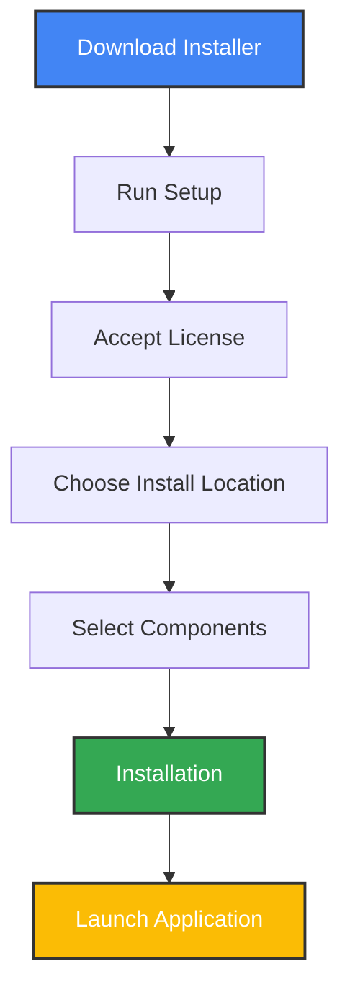
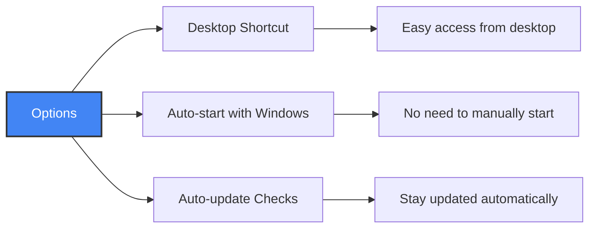
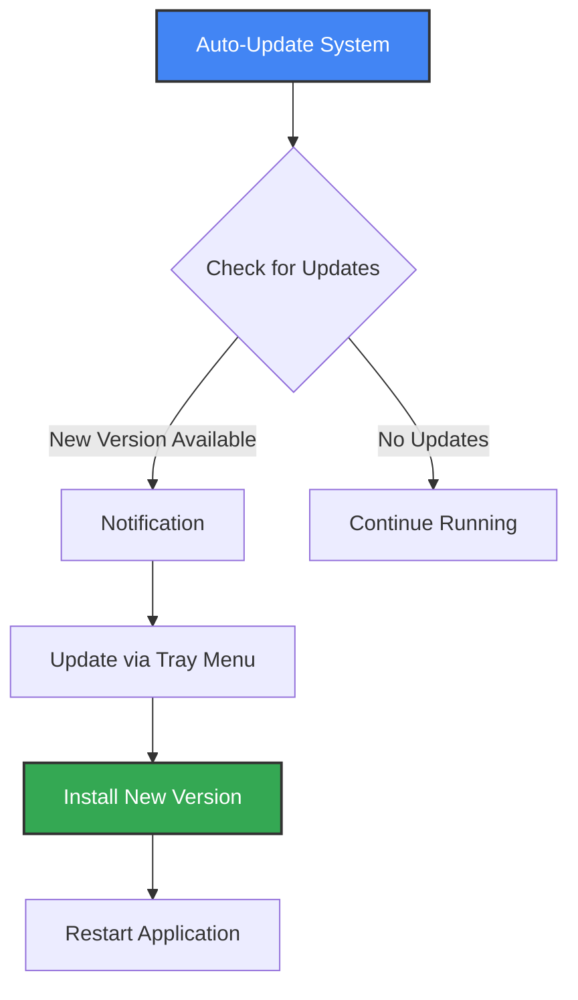
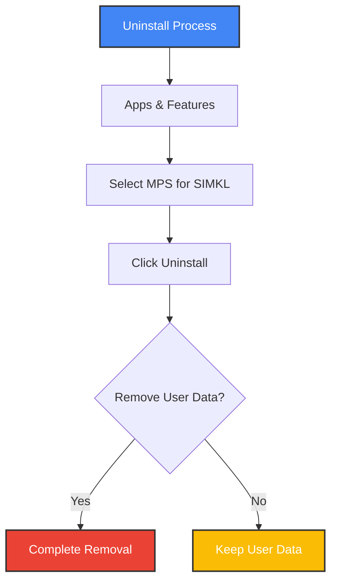

# 📥 Installation Guide

This guide covers detailed installation instructions for Media Player Scrobbler for SIMKL across different platforms.

## 📋 Quick Start Summary

| Platform | Recommended Installation Method |
|----------|--------------------------------|
| Windows | [Installer](#windows-installer) or [pip](#pip-installation) |
| macOS | [pip](#pip-installation) with macOS extras |
| Linux | [pip](#pip-installation) with Linux extras |

## 🚀 Installation Methods

### Windows Installer

The simplest way to get started on Windows:

1. Download and run the [latest installer](https://github.com/kavinthangavel/media-player-scrobbler-for-simkl/releases/latest)
2. Follow the installation wizard
3. Launch the application from the Start menu
4. Follow the authentication prompt to connect to your SIMKL account
5. The application will run in your system tray

## 🪟 Windows Installer Guide

MPS for SIMKL provides a dedicated Windows installer that simplifies installation and configuration.

### Installation Process



### Installer Options

The Windows installer offers several configuration options during setup:

#### Shortcut Options
- **Create desktop shortcut** - Adds a shortcut icon to your desktop
- **Start automatically when Windows starts** - Runs the application on system startup
- **Schedule weekly update checks** - Enables automatic update checking



### Installation Locations

The installer places files in these standard locations:

| Item | Location | Purpose |
|------|----------|---------|
| Program Files | `C:\Program Files\Media Player Scrobbler for SIMKL` | Application executables and assets |
| User Data | `%APPDATA%\kavinthangavel\simkl-mps` | Configuration, logs, and cache |
| Start Menu | Start Menu → MPS for SIMKL | Application shortcuts |
| Registry | `HKCU\Software\kavinthangavel\Media Player Scrobbler for SIMKL` | Settings and metadata |

### Auto-Update System

The Windows installer includes an automatic update system that:

1. Checks for updates weekly (when selected during installation)
2. Notifies you when updates are available
3. Allows one-click updates through the tray menu



### Post-Installation

After installation completes:

1. MPS for SIMKL starts automatically (if selected)
2. The system tray icon appears
3. Authentication with SIMKL is requested (first run only)
4. The application begins monitoring media players

### Uninstallation

To uninstall MPS for SIMKL:

1. Open **Settings** → **Apps** → **Apps & features**
2. Find "Media Player Scrobbler for SIMKL" in the list
3. Click **Uninstall**
4. Choose whether to remove user data and settings



### Silent Installation

For advanced users and IT administrators, the installer supports silent installation:

```batch
MPSS_Setup_2.0.0.exe /VERYSILENT /SUPPRESSMSGBOXES /NORESTART /TASKS="desktopicon,startupicon,scheduledupdate"
```

Options:
- `/VERYSILENT` - Install without UI
- `/SUPPRESSMSGBOXES` - No message boxes
- `/NORESTART` - Don't restart after installation
- `/TASKS` - Select which components to install:
  - `desktopicon` - Create desktop shortcut
  - `startupicon` - Auto-start with Windows
  - `scheduledupdate` - Enable update checks

### Pip Installation

For cross-platform installation with Python:

```bash
# Install using pip
pip install simkl-mps

# Initialize with your Simkl account
simkl-mps init

# Start the application
simkl-mps start
```

## ✅ Prerequisites

- Python 3.9 or higher
- pip (Python package manager)

### Platform-Specific Requirements

<details>
<summary><b>Windows</b></summary>

Windows has full support out of the box with no additional prerequisites.
</details>

<details>
<summary><b>macOS</b></summary>

For full functionality on macOS:
```bash
# Install with macOS extras
pip install "simkl-mps[macos]"
```
</details>

<details>
<summary><b>Linux</b></summary>

For window detection on Linux:

Ubuntu/Debian:
```bash
sudo apt install python3-pip wmctrl xdotool python3-gi gir1.2-gtk-3.0 libnotify-bin
pip install "simkl-mps[linux]"
```

Fedora:
```bash
sudo dnf install python3-pip wmctrl xdotool gtk3 libnotify
pip install "simkl-mps[linux]"
```

Arch Linux:
```bash
sudo pacman -S python-pip wmctrl xdotool gtk3 libnotify
pip install "simkl-mps[linux]"
```
</details>

## 🛠️ Advanced Installation Options

### Using pipx (Isolated Environment)

[pipx](https://pypa.github.io/pipx/) installs packages in isolated environments while making their entry points globally available:

```bash
# Install pipx if not already installed
python -m pip install --user pipx
python -m pipx ensurepath  # Restart terminal after this

# Install simkl-mps
pipx install simkl-mps

# For macOS specific dependencies
pipx install simkl-mps --extras macos

# For Linux specific dependencies
pipx install simkl-mps --extras linux
```

### Development Installation (from source)

```bash
# Clone repository
git clone https://github.com/kavinthangavel/media-player-scrobbler-for-simkl.git
cd media-player-scrobbler-for-simkl

# Install with Poetry
poetry install

# Run commands
poetry run simkl-mps init
poetry run simkl-mps start
```

## 🚀 Post-Installation Setup

### Authentication

When you first run the application, you'll be guided through authentication with Simkl:

1. The application will display a URL and device code
2. Visit the URL on any device and enter the code
3. Authorize the application to access your Simkl account
4. The application will automatically complete the setup once authorized

### Media Player Setup

For optimal tracking accuracy, configure your media players according to the [Media Players guide](media-players.md#⚙️-player-configuration-for-advanced-tracking).

## ✨ Verifying Installation

After installation, verify that the application is properly installed:

```bash
simkl-mps --version
```

This will display version information about the installed application.

## 🚦 Running the Application

There are multiple ways to run the application:

| Command | Description |
|---------|-------------|
| `simkl-mps start` | Run in background (recommended for daily use) |
| `simkl-mps tray` | Run in foreground with system tray icon |
| `simkl-mps daemon` | Run as a daemon service (Linux/macOS only) |
| `simkl-mps stop` | Stop the running application |
| `simkl-mps status` | Check if the application is running |

For more details, see the [Usage Guide](usage.md).
