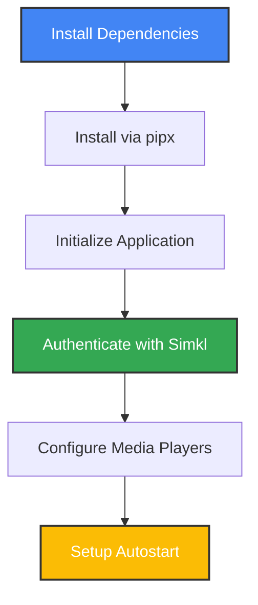
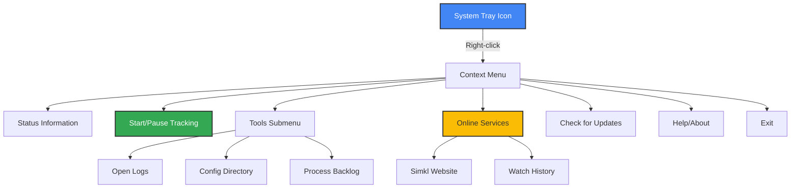

# 🐧 Linux Installation & Configuration Guide

This comprehensive guide provides detailed instructions specifically for Linux users of Media Player Scrobbler for Simkl, focusing on installation, system integration, and media player configuration for various Linux distributions.

> **Important Note**: Currently, the application supports **movie tracking only**. TV show tracking is planned for future updates.

## 📥 Linux Installation

### Required Dependencies

Before installing, ensure you have the necessary system dependencies based on your distribution:

**For Ubuntu/Debian:**
```bash
sudo apt install pipx python3-tk python3-pip python3-dev python3-setuptools wmctrl xdotool python3-gi python3-gi-cairo gir1.2-gtk-3.0 libgirepository1.0-dev libcairo2-dev pkg-config libnotify-bin python3-venv gir1.2-appindicator3-0.1 gnome-shell-extension-appindicator
```

**For Fedora/RHEL/CentOS:**
```bash
sudo dnf install pipx python3-tk python3-pip python3-devel gobject-introspection-devel cairo-devel pkg-config python3-gobject gtk3 wmctrl xdotool libnotify
```

**For Arch Linux:**
```bash
sudo pacman -S pipx python3-tk python-pip python-setuptools python-gobject gtk3 gobject-introspection cairo pkg-config wmctrl xdotool libnotify
```

### Installation Process



1. Install the application using pipx (recommended for better isolation):
   ```bash
   # Install pipx if not already installed
   python3 -m pip install --user pipx
   python3 -m pipx ensurepath
   
   # Install simkl-mps with Linux extras
   pipx install --system-site-packages "simkl-mps[linux]"
   ```

   Alternatively, use pip directly:
   ```bash
   pip install --user "simkl-mps[linux]"
   ```

2. Initialize the application:
   ```bash
   simkl-mps init
   ```

3. Start the application:
   ```bash
   simkl-mps start
   ```

## 🔧 System Tray Integration

### Tray Icon Troubleshooting

If the system tray icon doesn't appear (common on some Linux distributions), follow these steps:

#### For GNOME-based distros (Ubuntu, Fedora Workstation, etc.):

1. Ensure you have the AppIndicator extension installed:
   ```bash
   # For Ubuntu/Debian
   sudo apt install gnome-shell-extension-appindicator
   
   # For Fedora
   sudo dnf install gnome-shell-extension-appindicator
   ```

2. Enable the AppIndicator extension:
   - Open the "Extensions" application
   - Enable "AppIndicator and KStatusNotifierItem Support"
   - Or visit: https://extensions.gnome.org/extension/615/appindicator-support/

3. Restart GNOME Shell:
   - Press Alt+F2, type "r" and press Enter
   - Or log out and log back in

4. Run the diagnostic script to check tray compatibility:
   ```bash
   python3 -m simkl_mps.utils.linux_tray_diagnostics
   ```

#### For KDE Plasma:

KDE Plasma has good built-in support for system tray icons. If you're experiencing issues:

1. Right-click on the system tray
2. Select "Configure System Tray"
3. Ensure "Legacy Tray" is enabled

#### For Xfce, MATE, and Cinnamon:

These desktop environments have good support for system tray icons by default. If issues persist:

1. Right-click on the panel
2. Look for "Panel Settings" or similar
3. Ensure the "Notification Area" or "System Tray" is added to the panel

### Running in Foreground Mode

If you're troubleshooting or want to see logs in real-time:

```bash
simkl-mps tray
```

This will run the application attached to the terminal, displaying all logs. Press Ctrl+C to exit.

## 🚀 Setting Up Autostart

To make simkl-mps start automatically when you log in:

### Method 1: Desktop Entry (Recommended)

1. Create a desktop entry file:
   ```bash
   mkdir -p ~/.config/autostart
   cat > ~/.config/autostart/simkl-mps.desktop << EOF
   [Desktop Entry]
   Type=Application
   Name=Media Player Scrobbler for SIMKL
   Exec=simkl-mps start
   Icon=media-player
   Comment=Automatically track media playback and scrobble to SIMKL
   Categories=Utility;
   Terminal=false
   StartupNotify=false
   EOF
   ```

2. Make it executable:
   ```bash
   chmod +x ~/.config/autostart/simkl-mps.desktop
   ```

### Method 2: Using Your Desktop Environment's Autostart Settings

#### For GNOME:
1. Open "Startup Applications"
2. Click "Add"
3. Set Name: "Media Player Scrobbler for SIMKL"
4. Set Command: `simkl-mps start`
5. Add a description if desired
6. Click "Add"

#### For KDE Plasma:
1. Go to System Settings > Startup and Shutdown > Autostart
2. Click "Add Program"
3. Search for simkl-mps or select "Add Custom Script"
4. Enter `simkl-mps start` as the command
5. Click "OK" or "Apply"

#### For Xfce:
1. Go to Settings > Session and Startup > Application Autostart
2. Click "Add"
3. Name: "Media Player Scrobbler for SIMKL"
4. Command: `simkl-mps start`
5. Click "OK"

## ⚙️ Media Player Configuration on Linux

For the best movie tracking experience, configure your preferred media players:

### VLC Media Player

**Step-by-Step Configuration:**
1. Open VLC Media Player
2. Navigate to **Tools → Preferences**
3. At the bottom left, change **Show settings** to **All**
4. Navigate to **Interface → Main interfaces**
5. Check the box for **Web** to enable the web interface
6. Go to **Interface → Main interfaces → Lua**
7. Set a password in the **Lua HTTP Password** field
8. Click **Save** and restart VLC

### MPV Media Player (Recommended for Linux)

**Configuration Steps:**
1. Create or edit the MPV configuration file:
   ```bash
   mkdir -p ~/.config/mpv
   echo 'input-ipc-server=/tmp/mpvsocket' >> ~/.config/mpv/mpv.conf
   ```
2. Save and restart MPV

### Celluloid (GNOME MPV)

Celluloid is a GTK frontend for MPV, and you'll need to configure the underlying MPV:

1. Edit the MPV config as above
2. In Celluloid, go to Preferences > MPV Configuration
3. Add: `input-ipc-server=/tmp/mpvsocket`
4. Restart Celluloid

## 🖥️ Linux System Integration

### System Tray Features

Right-click the system tray icon to access:



- **Status information**: Current monitoring state and connection status
- **Start/Pause Tracking**: Toggle monitoring
- **Tools**: Access to logs, configuration, and backlog management
- **Exit**: Close the application

### Linux-Specific File Locations

- **Configuration file**: `~/.local/share/kavinthangavel/simkl-mps/.simkl_mps.env`
- **Log files**: `~/.local/share/kavinthangavel/simkl-mps/simkl_mps.log`
- **Backlog database**: `~/.local/share/kavinthangavel/simkl-mps/backlog.db`

## 🔄 Updates

To update your installation:

```bash
# If installed with pipx
pipx upgrade simkl-mps

# If installed with pip
pip install --upgrade --user "simkl-mps[linux]"
```

## 🚀 Optimizing for Linux

### Performance Tips

1. **Use MPV or VLC** for the most reliable tracking
2. Enable **autostart** for convenience
3. **Proper filenames** significantly improve movie identification:
   - Best format: `Movie Title (Year).extension`
   - Example: `Inception (2010).mkv`
4. For GNOME users, ensure the AppIndicator extension is enabled
5. If system tray is important, consider using KDE Plasma or Xfce which have better system tray support

### Resource Usage

- **Memory**: 30-60 MB (typical)
- **CPU**: Minimal (1-2% during active tracking)
- **Disk**: Minimal (~1 MB for database and logs)
- **Network**: Only when identifying movies or syncing with Simkl

## 🔍 Linux Troubleshooting

### Common Issues

| Issue | Solution |
|-------|----------|
| Dependencies missing | Run diagnostics script and install required packages |
| Tray icon missing | Install and enable AppIndicator extension (GNOME) or check panel settings |
| Python module errors | Ensure you installed with the Linux extras: `simkl-mps[linux]` |
| VLC connection fails | Verify web interface is enabled and password is correct |
| MPV not detected | Check if socket path in config is correct: `/tmp/mpvsocket` |
| Movie not identified | Use clearer filename, check log for details |

### Checking Logs on Linux

1. View logs in real-time with:
   ```bash
   tail -f ~/.local/share/kavinthangavel/simkl-mps/simkl_mps.log
   ```

2. Or open in your text editor:
   ```bash
   xdg-open ~/.local/share/kavinthangavel/simkl-mps/simkl_mps.log
   ```

### Running with Debug Logging

For advanced troubleshooting:
```bash
simkl-mps tray --debug
```

### Diagnostics Script

Run the built-in diagnostics script to check your environment:
```bash
python3 -m simkl_mps.utils.linux_tray_diagnostics
```

## 🔔 Final Checklist for Linux Users

1. ✅ Install all required dependencies for your distribution
2. ✅ Install simkl-mps with Linux extras
3. ✅ Configure your media players (critical step!)
4. ✅ Fix any system tray issues using the guide above
5. ✅ Set up autostart for convenience
6. ✅ Use proper filenames for your movies
7. ✅ Play a movie and verify it's detected and tracked
8. ✅ Check your Simkl profile to confirm movies are marked as watched
