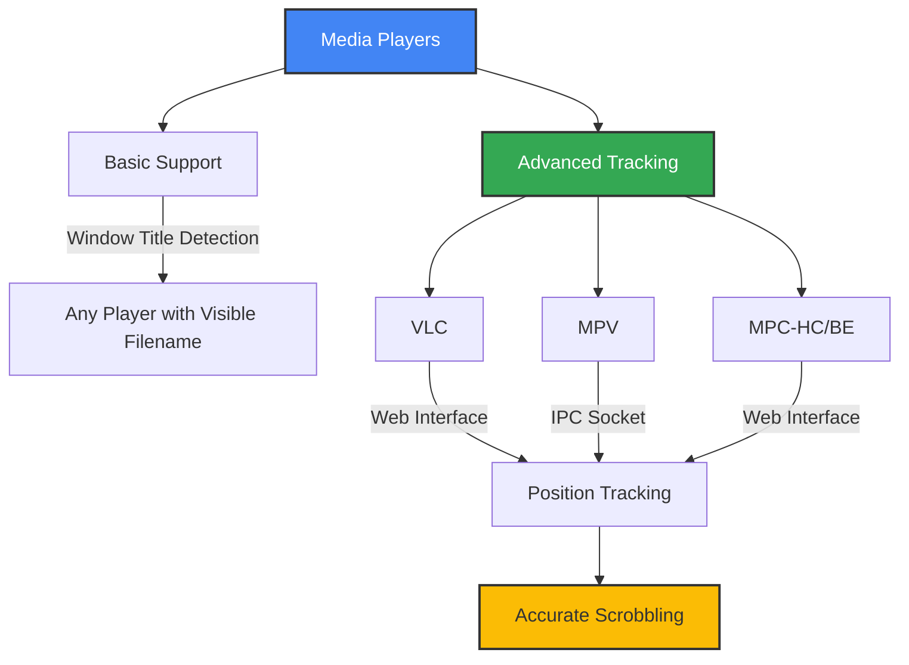
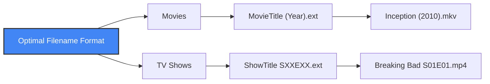

# 🎬 Supported Media Players

This document details the media players compatible with MPS for SIMKL and how to configure them for optimal tracking.

## 📋 Player Compatibility Matrix



### Windows Support

| Media Player | Basic Support | Advanced Position Tracking | Configuration Method |
|--------------|:-------------:|:---------------------------:|---------------------|
| VLC | ✅ | ✅ | Web interface (port 8080) |
| MPC-HC/BE | ✅ | ✅ | Web interface (port 13579) |
| MPV | ✅ | ✅ | IPC socket (named pipe) |
| PotPlayer | ✅ | ✅ | Web interface (port 8080) [Still in Testing] |
| Windows Media Player | ✅ | ❌ | Window title only |
| SMPlayer | ✅ | ❌ | Window title only |
| KMPlayer | ✅ | ❌ | Window title only |
| GOM Player | ✅ | ❌ | Window title only |

### macOS Support

| Media Player | Basic Support | Advanced Position Tracking | Configuration Method |
|--------------|:-------------:|:---------------------------:|---------------------|
| VLC | ✅ | ✅ | Web interface (port 8080) |
| MPV | ✅ | ✅ | IPC socket (UNIX socket) |
| QuickTime | ✅ | ❌ | Window title only |
| Elmedia Player | ✅ | ❌ | Window title only |
| Movist Pro | ✅ | ❌ | Window title only |

### Linux Support

| Media Player | Basic Support | Advanced Position Tracking | Configuration Method |
|--------------|:-------------:|:---------------------------:|---------------------|
| VLC | ✅ | ✅ | Web interface (port 8080) |
| MPV | ✅ | ✅ | IPC socket (UNIX socket) |
| SMPlayer | ✅ | ❌ | Window title only |
| Totem | ✅ | ❌ | Window title only |
| Kaffeine | ✅ | ❌ | Window title only |

## 🎯 Understanding Tracking Methods

### Basic Support vs. Advanced Tracking


#### Basic Support (All Players)
- Works by monitoring the player's window title
- Extracts media information from the filename shown in the title
- Estimates when you've watched enough to mark as completed
- No player configuration required

#### Advanced Tracking (Selected Players)
- Connects directly to the media player's API
- Retrieves exact playback position and total duration
- Accurately calculates completion percentage
- Requires specific player configuration (see below)

## ⚙️ Player Configuration Guide

### VLC Media Player

<details>
<summary><b>Enabling the VLC Web Interface</b></summary>

1. Open VLC and go to **Tools** > **Preferences** (or **VLC** > **Preferences** on macOS)
2. Click **Show settings: All** at the bottom left
3. Navigate to **Interface** > **Main interfaces**
4. Check the box for **Web**
5. Go to **Interface** > **Main interfaces** > **Lua**
6. Set a password in **Lua HTTP Password** (recommended: `simkl`)
7. Keep the default port (8080) or change it if needed
8. Click **Save** and restart VLC

**Testing:** Open `http://localhost:8080` in your browser. You should see the VLC web interface.

**Configuration Options:**
```ini
# In .simkl_mps.env:
SIMKL_VLC_PORT=8080
SIMKL_VLC_PASSWORD=simkl
```
</details>

### MPV Player

<details>
<summary><b>Setting Up MPV IPC Socket</b></summary>

1. Create or locate the MPV configuration directory:
   - Windows: `%APPDATA%\mpv\`
   - macOS/Linux: `~/.config/mpv/`
2. Create or edit `mpv.conf` in this directory
3. Add the following line:
   ```
   # For Windows:
   input-ipc-server=\\.\pipe\mpvsocket
   
   # For macOS/Linux:
   input-ipc-server=/tmp/mpvsocket
   ```
4. Save the file and restart MPV

**IINA (macOS):** Open IINA Preferences > Advanced and add the socket configuration.

**Configuration Options:**
```ini
# In .simkl_mps.env:
# For Windows:
SIMKL_MPV_SOCKET_PATH=\\.\pipe\mpvsocket

# For macOS/Linux:
SIMKL_MPV_SOCKET_PATH=/tmp/mpvsocket
```
</details>

### MPC-HC / MPC-BE (Windows Only)

<details>
<summary><b>Configuring MPC Web Interface</b></summary>

1. Open MPC-HC/BE and go to **View** > **Options**
2. Navigate to **Player** > **Web Interface** (or just **Web Interface** in MPC-BE)
3. Check **Listen on port:** (default is 13579)
4. Click **OK** and restart MPC

**Testing:** Open `http://localhost:13579` in your browser. You should see the MPC web interface.

**Configuration Options:**
```ini
# In .simkl_mps.env:
SIMKL_MPC_PORT=13579
```
</details>

### PotPlayer (Windows Only) [Testing]

<details>
<summary><b>Enabling PotPlayer Web Interface</b></summary>

1. Open PotPlayer and press **F5** to open Preferences
2. Navigate to **Others** > **Web Control Interface**
3. Check **Listen to HTTP request on port:** (default is 8080)
4. Click **Apply** and **OK**, then restart PotPlayer

**Testing:** Open `http://localhost:8080` in your browser. You should see the PotPlayer web interface.

**Configuration Options:**
```ini
# In .simkl_mps.env:
SIMKL_POTPLAYER_PORT=8080
```
</details>

## 💡 Optimizing Media Detection

### Filename Best Practices



#### Movie Filename Format
- Include the full movie title
- Add the release year in parentheses
- Example: `Inception (2010).mkv`

#### TV Show Filename Format
- Include the full show title
- Use standard season/episode notation (S01E01)
- Example: `Breaking Bad S01E01.mp4`

## 🔧 Troubleshooting Player Integration

### Common Issues and Solutions

| Problem | Possible Causes | Solutions |
|---------|----------------|-----------|
| Cannot connect to VLC | Web interface not enabled<br>Wrong password | Check VLC settings<br>Verify password in config |
| MPV socket not found | Wrong socket path<br>Config not saved | Verify configuration<br>Check file permissions |
| MPC web interface not responding | Interface not enabled<br>Port conflict | Check MPC settings<br>Try different port |
| Position tracking not working | Player not supported<br>Connection issue | Use supported player<br>Verify settings |

### Testing Your Configuration

To verify your player is properly configured:

1. Start your media player with advanced tracking enabled
2. Run MPS for SIMKL with debug logging:
   ```bash
   simkl-mps tray --debug
   ```
3. Play a media file
4. Check the logs for `Connected to [player]` and position data

### Alternative Approaches

If advanced tracking isn't working:

1. **Use window title detection:** Works with any player showing filenames
2. **Try a different supported player:** VLC works well on all platforms
3. **Name files clearly:** Good filenames help with basic detection
