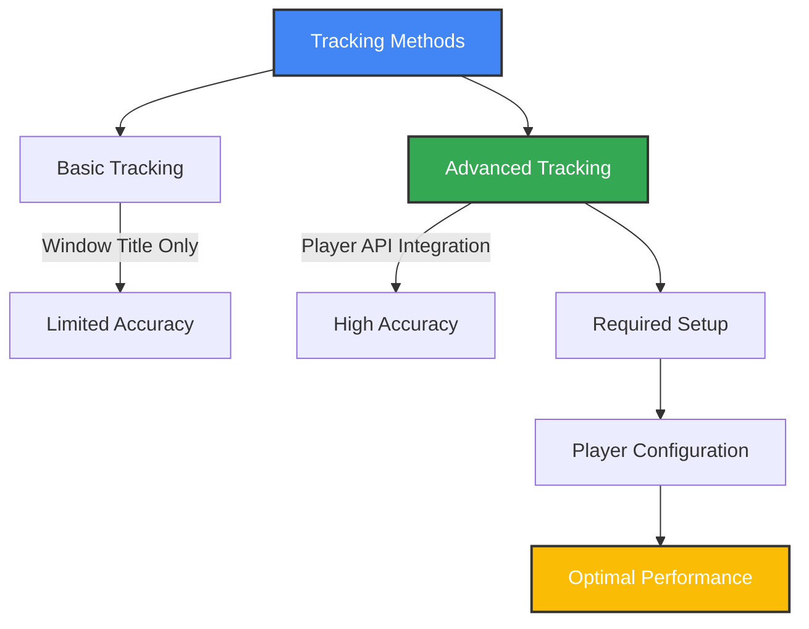
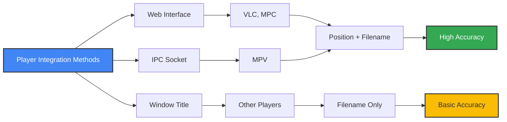
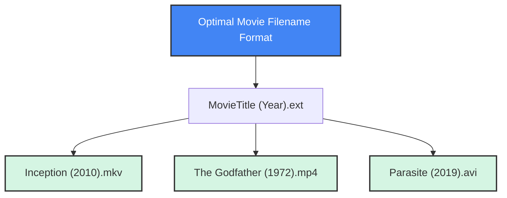

# 🎥 Supported Media Players

This guide provides comprehensive information about compatible media players and detailed configuration instructions to ensure optimal movie tracking performance.

## ⚠️ Important: Media Player Configuration

**Media player configuration is a critical step for accurate movie tracking.** While the application can work with basic window title detection, configuring your media players for advanced tracking significantly improves accuracy and reliability.



## 🗂️ Compatibility Matrix

| Player                | Windows | macOS | Linux | Advanced Tracking | Configuration Difficulty |
|-----------------------|:-------:|:-----:|:-----:|:----------------:|:----------------------:|
| VLC                   | ✅      | ✅    | ✅    | ✅              | Easy                   |
| MPV                   | ✅      | ✅    | ✅    | ✅              | Moderate               |
| MPC-HC/BE             | ✅      | ❌    | ❌    | ✅              | Easy                   |
| Infuse                | ❌      | ✅    | ❌    | ✅              | Moderate               |
| Windows Media Player  | ✅      | ❌    | ❌    | ❌              | Not Available          |
| QuickTime             | ❌      | ✅    | ❌    | ❌              | Not Available          |
| Other Players         | ✅      | ✅    | ✅    | ❌              | Not Available          |

> **Note**: The application currently supports **movie tracking only**. TV show support is planned for future updates.

---

## 🪟 Windows Media Player Configuration

### VLC Media Player (Recommended)

**Step-by-Step Configuration:**
1. Open VLC Media Player
2. Navigate to **Tools → Preferences**
3. At the bottom left, change **Show settings** to **All**
4. Navigate to **Interface → Main interfaces**
5. Check the box for **Web** to enable the web interface
6. Go to **Interface → Main interfaces → Lua**
7. Set a password in the **Lua HTTP Password** field (remember this password)
8. Optional: Change the port number (default is 8080)
9. Click **Save** and restart VLC
10. Visit http://localhost:8080/
11. Enter Your Password (Set in Step 7) 

> For Detailed Step by Step Config [Config with Images](https://github.com/azrafe7/vlc4youtube/blob/55946aaea09375cfa4dc0dbae0428ad13eb9e046/instructions/how-to-enable-vlc-web-interface.md) - Make Sure to set a Password

**Verification:**
- The scrobbler will automatically connect to VLC on port 8080 (or your custom port)
- Play a movie in VLC to test - you should see accurate position tracking

### MPV Media Player

**Windows Configuration:**
1. Locate or create the MPV configuration directory:
   - Press `Win+R` and enter `%APPDATA%` to open the Roaming folder
   Or
   - Navigate to `%APPDATA%\mpv\` (create it if it doesn't exist)
3. Create or edit `mpv.conf` file
4. Add the following lines:
   ```
   # Enable IPC socket for advanced tracking
   input-ipc-server=\\.\pipe\mpvsocket
   ```
5. Save the file and restart MPV

**Verification:**
- Play a movie in MPV
- The scrobbler will connect to the pipe socket
- Position data should be accurately tracked

### MPC-HC/BE (Media Player Classic)

**Step-by-Step Configuration:**
1. Open MPC-HC or MPC-BE
2. Navigate to **View → Options**
3. Go to **Player → Web Interface**
4. Check **Listen on port:** and ensure it's set to **13579** (default)
5. Click **OK** and restart MPC

**Verification:**
- Play a movie in MPC
- The scrobbler will connect to the web interface
- Position data should be accurately tracked

---

## 🍏 macOS Media Player Configuration

### VLC Media Player

Follow the same configuration steps as shown in the Windows VLC section above.

### MPV Media Player

1. Create or locate the MPV configuration directory:
   - `~/.config/mpv/` (create it if it doesn't exist)
2. Create or edit `mpv.conf`
3. Add the following line:
   ```
   # Enable IPC socket for advanced tracking
   input-ipc-server=/tmp/mpvsocket
   ```
4. Save and restart MPV

### Infuse (macOS)

Infuse is a popular media player for macOS (and iOS/Apple TV). To enable tracking with Infuse:

1. Ensure Infuse is running on your Mac.
2. Enable network sharing or remote control features in Infuse settings (if available).
3. Make sure your Mac firewall allows connections from the scrobbler.
4. The scrobbler will attempt to detect Infuse windows and parse titles for tracking.
5. Advanced integration may require additional setup in future releases.

> **Note:** Infuse support is experimental and may require further configuration or updates.

### QuickTime

Basic window title tracking only. No advanced integration available.

---

## 🐧 Linux Media Player Configuration

### VLC Media Player

Follow the same configuration steps as shown in the Windows VLC section above.

### MPV Media Player

1. Create or locate the MPV configuration directory:
   - `~/.config/mpv/` (create it if it doesn't exist)
2. Create or edit `mpv.conf`
3. Add the following line:
   ```
   # Enable IPC socket for advanced tracking
   input-ipc-server=/tmp/mpvsocket
   ```
4. Ensure the socket path has appropriate permissions
5. Save and restart MPV

---

## 🧠 Tracking Methods Explained



### Advanced Tracking
With advanced tracking (properly configured players):
- Exact playback position is known
- Precise tracking of watch progress
- Accurate determination of when a movie is completed
- Better handling of pauses and skips

### Basic Tracking
Without player configuration:
- Relies only on window titles
- Less accurate progress estimation
- May miss some watch events
- More prone to false positives/negatives

---

## 🏷️ Filename Best Practices

For optimal movie identification, follow these naming conventions:



**Recommended Format:** `MovieTitle (Year).extension`

**Examples:**
- `Inception (2010).mkv`
- `The Shawshank Redemption (1994).mp4`
- `Pulp Fiction (1994).avi`

**Additional Tips:**
- Include the year for better identification
- Avoid extra text like quality info or release group names in main filename
- Remove unnecessary punctuation


---

## 🛠️ Troubleshooting Player Configuration

| Issue | Possible Cause | Solution |
|-------|----------------|----------|
| VLC connection fails | Web interface not enabled | Enable web interface in VLC settings |
| | Wrong password | Check the password in VLC Lua HTTP settings |
| | Port conflict | Change the port in VLC settings |
| MPV socket error | Incorrect socket path | Verify the path in mpv.conf matches expectations |
| | Permission issues | Check file permissions on the socket |
| MPC-HC not detected | Web interface disabled | Enable web interface in MPC options |
| | Wrong port | Verify port is set to 13579 |
| General tracking issues | Filename format | Ensure movie files follow naming best practices |

### Testing Player Configuration

1. Configure your media player according to the instructions
2. Start the Media Player Scrobbler for Simkl with debug logging:
   ```bash
   simkl-mps tray --debug
   ```
3. Play a movie in your configured media player
4. Check the logs for connection messages and position data
5. If successful, position data should appear in the logs

---

## 📊 Player Comparison

| Feature | VLC | MPV | MPC-HC/BE | Infuse |
|---------|-----|-----|-----------|--------|
| Ease of configuration | ★★★★☆ | ★★☆☆☆ | ★★★★☆ | ★★★☆☆ |
| Cross-platform | ✅ | ✅ | ❌ | ❌ |
| Position accuracy | Very High | High | Very High | High |
| Resource usage | Moderate | Low | Low | Moderate |
| Recommended for | Beginners | Power users | Windows users | Mac users |

The best player for tracking depends on your platform and preferences, but properly configured **VLC** offers the most universal compatibility and reliable tracking.
