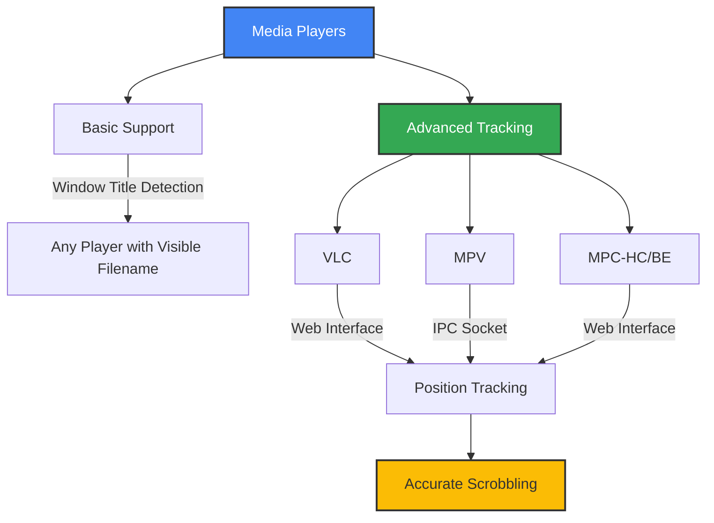
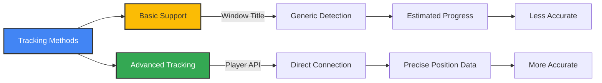
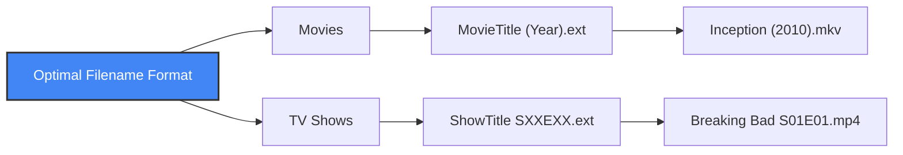

# 🎥 Supported Media Players

This guide lists compatible media players and explains how to configure them for best tracking.

## 🗂️ Compatibility Matrix

---

## 🪟 Windows
| Player                | Basic | Advanced | Config Method         |
|-----------------------|:-----:|:--------:|----------------------|
| VLC                   | ✅    | ✅       | Web interface (8080) |
| MPC-HC/BE             | ✅    | ✅       | Web interface (13579)|
| MPV                   | ✅    | ✅       | IPC socket           |
| PotPlayer             | ✅    | ✅       | Web interface (8080) |
| Windows Media Player  | ✅    | ❌       | Window title only    |
| SMPlayer, KMPlayer... | ✅    | ❌       | Window title only    |

## 🍏 macOS
| Player         | Basic | Advanced | Config Method         |
|---------------|:-----:|:--------:|----------------------|
| VLC           | ✅    | ✅       | Web interface (8080) |
| MPV           | ✅    | ✅       | IPC socket           |
| QuickTime     | ✅    | ❌       | Window title only    |
| Elmedia, Movist| ✅   | ❌       | Window title only    |

## 🐧 Linux
| Player         | Basic | Advanced | Config Method         |
|---------------|:-----:|:--------:|----------------------|
| VLC           | ✅    | ✅       | Web interface (8080) |
| MPV           | ✅    | ✅       | IPC socket           |
| SMPlayer, Totem| ✅   | ❌       | Window title only    |
| Kaffeine       | ✅    | ❌       | Window title only    |

---

## 🧠 Tracking Methods

- **Basic:** Works by window title, no config needed, less accurate
- **Advanced:** Uses player API for exact position, needs setup, more accurate

---

## ⚙️ Player Configuration Guides

<b>VLC (All Platforms)</b>

Enable web interface (port 8080), set password, restart VLC. See [Configuration](configuration.md).

<b>MPV (All Platforms)</b>

Set up IPC socket in `mpv.conf`. See [Configuration](configuration.md).

<b>MPC-HC/BE (Windows)</b>

Enable web interface (port 13579) in options. See [Configuration](configuration.md).

<b>PotPlayer (Windows, Testing)</b>

Enable web interface (port 8080) in preferences.

---

## 🏷️ Filename Best Practices

- Movies: `Inception (2010).mkv`
- TV: `Breaking Bad S01E01.mp4`

---

## 🛠️ Troubleshooting & Testing

| Problem                  | Solution                                  |
|--------------------------|-------------------------------------------|
| Can't connect to VLC     | Enable web interface, check password      |
| MPV socket not found     | Check socket path, permissions            |
| MPC web not responding   | Enable interface, check port              |
| Position not working     | Use supported player, verify config       |

**Test your setup:**
1. Start player with advanced tracking enabled
2. Run `simkl-mps tray --debug`
3. Play a media file
4. Check logs for connection and position data

If advanced tracking fails:
- Use window title detection
- Try a different player (VLC is most reliable)
- Use clear filenames for best results
