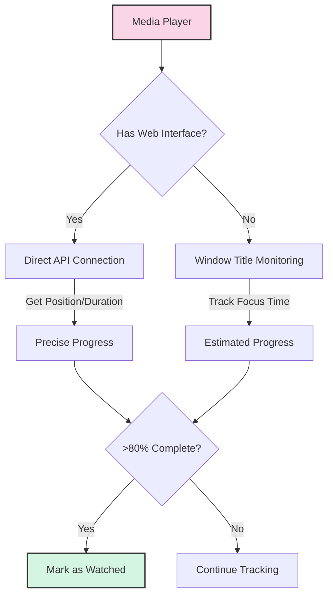

# 🎬 Supported Media Players

This document details the media players supported by Simkl Scrobbler and how to configure them for optimal tracking.

## 📋 Player Compatibility Table

### Windows

| Media Player | Support Status | Position Detection |
|-------------|----------------|-------------------|
| VLC Media Player | ✅ Fully Supported | ✅ (with web interface) |
| MPC-HC/BE | ✅ Fully Supported | ✅ (with web interface) |
| MPV Player | ✅ Fully Supported | ✅ (with IPC) |
| PotPlayer | ✅ Fully Supported | ✅ (with WebRemote) |
| Windows Media Player | ✅ Fully Supported | ⚠️ Title only |
| SMPlayer | ✅ Fully Supported | ⚠️ Title only |
| KMPlayer | ✅ Fully Supported | ⚠️ Title only |
| GOM Player | ✅ Fully Supported | ⚠️ Title only |

### macOS

| Media Player | Support Status | Position Detection |
|-------------|----------------|-------------------|
| VLC Media Player | ✅ Fully Supported | ✅ (with web interface) |
| MPV Player | ✅ Fully Supported | ✅ (with IPC) |
| IINA | ✅ Fully Supported | ⚠️ Title only |
| QuickTime Player | ✅ Basic Support | ⚠️ Title only |
| Elmedia Player | ✅ Basic Support | ⚠️ Title only |
| Movist/Movist Pro | ✅ Basic Support | ⚠️ Title only |

### Linux

| Media Player | Support Status | Position Detection |
|-------------|----------------|-------------------|
| VLC Media Player | ✅ Fully Supported | ✅ (with web interface) |
| MPV Player | ✅ Fully Supported | ✅ (with IPC) |
| SMPlayer | ✅ Fully Supported | ⚠️ Title only |
| Totem | ✅ Basic Support | ⚠️ Title only |
| Celluloid | ✅ Basic Support | ⚠️ Title only |
| Kaffeine | ✅ Basic Support | ⚠️ Title only |
| Dragon Player | ✅ Basic Support | ⚠️ Title only |
| Parole | ✅ Basic Support | ⚠️ Title only |

## 🔍 Position Detection Methods

Simkl Scrobbler can detect playback position in two ways:

1. **🎯 Advanced Position Tracking**: Gets precise position and duration from the player
2. **📊 Basic Title Tracking**: Estimates progress based on window focus time

For the best experience, we recommend setting up advanced position tracking.

### Position Tracking Flow



## ⚙️ Player Configuration for Advanced Tracking

### 🎵 VLC Media Player

1. Go to Tools > Preferences
2. Select "All" settings (bottom left)
3. Navigate to Interface > Main interfaces
4. Check "Web" option
5. Must: Set a password in the "Lua HTTP" section
6. Click "Save"
7. Restart VLC

**Default Address**: http://127.0.0.1:8080/

### 🎬 MPC-HC/BE (Windows only)

1. Go to View > Options > Player > Web Interface
2. Check "Listen on port:" (default 13579)
3. Click "OK"
4. Restart MPC

**Default Address**: http://127.0.0.1:13579/

### 📼 MPV Player

1. Create or edit `mpv.conf` in the mpv config directory:
   - Windows: `%APPDATA%\mpv\mpv.conf`
   - macOS: `~/.config/mpv/mpv.conf`
   - Linux: `~/.config/mpv/mpv.conf`
2. Add the following lines:
   ```
   # For Unix-based systems (macOS/Linux)
   input-ipc-server=/tmp/mpvsocket
   
   # For Windows
   input-ipc-server=\\.\pipe\mpvsocket
   ```
3. Restart MPV

### 🎮 PotPlayer (Windows only)

1. Open PotPlayer
2. Go to Preferences (F5) > Others > Web Control Interface
3. Check "Listen to HTTP request on port:" (default 8080)
4. Click "Apply" and "OK"
5. Restart PotPlayer

**Default Address**: http://127.0.0.1:8080/

## 🔧 Troubleshooting Player Integration

### VLC

- If tracking doesn't work, verify web interface is enabled in VLC preferences
- Try different port if 8080 is already in use (change in VLC settings)
- On Linux, ensure firewall allows connections to the port

### MPV

- Verify the IPC socket/pipe path matches what's in your configuration
- For Windows, make sure the pipe name is correct: `\\.\pipe\mpvsocket`
- For Unix, check permissions on `/tmp/mpvsocket`

### General Tips

- Ensure media filenames include the movie title in a recognizable format
- For better matching, include the release year: `Movie Name (2023).mp4`
- Check the application logs if a specific player isn't being detected
