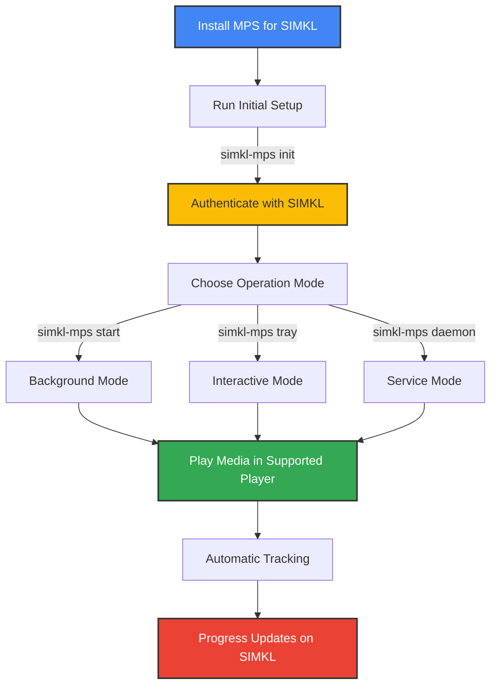
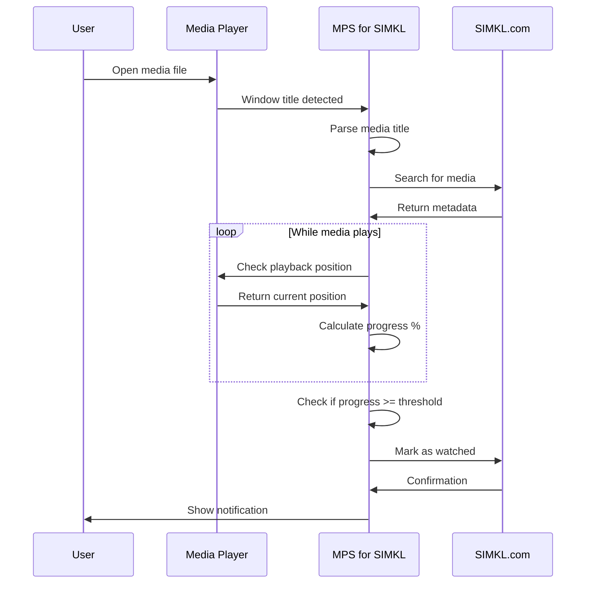
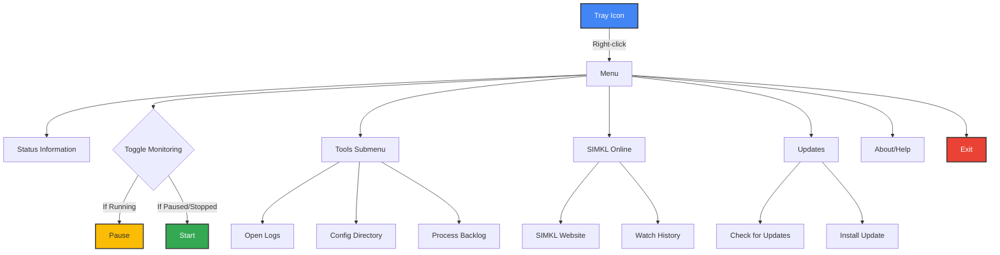

# 🎮 Usage Guide

This document explains how to effectively use MPS for SIMKL to automatically track your media watching activity.

## 📋 Quick Command Reference

| Command | Shorthand | Description |
|---------|-----------|-------------|
| `simkl-mps init` | `simkl-mps i` | Initial setup and authentication |
| `simkl-mps start` | `simkl-mps s` | Start tracking in background mode |
| `simkl-mps tray` | `simkl-mps t` | Launch with interactive tray interface |
| `simkl-mps stop` | `simkl-mps x` | Stop the running application |
| `simkl-mps status` | `simkl-mps st` | Check if the application is running |
| `simkl-mps version` | `simkl-mps -v` | Show version information |
| `simkl-mps clean` | `simkl-mps c` | Clean old backlog entries |
| `simkl-mps backlog` | `simkl-mps b` | Manage offline backlog entries |

## 🚀 Getting Started



## 🔄 Operation Modes

### Background Mode (Recommended)

```bash
simkl-mps start
```

This mode is ideal for everyday use:
- Runs silently in the system tray
- Continues after terminal is closed
- Low resource usage
- Status visible via tray icon
- Auto-starts on system boot (optional)

### Interactive Tray Mode

```bash
simkl-mps tray
```

Best for testing and troubleshooting:
- Shows real-time console output
- Allows monitoring detection process
- Requires terminal to remain open
- Helpful for initial configuration

### Service Mode (Linux/macOS)

```bash
# Install as system service
simkl-mps daemon install

# Control the service
simkl-mps daemon start
simkl-mps daemon status
simkl-mps daemon stop
simkl-mps daemon uninstall
```

## 💻 Common Command-Line Options

```bash
# Enable detailed logging
simkl-mps start --debug

# Change poll frequency (in seconds)
simkl-mps start --interval 5

# Adjust completion threshold (percentage)
simkl-mps start --threshold 90

# Disable notifications
simkl-mps start --no-notify

# Custom configuration file
simkl-mps start --config /path/to/config.env

# Combine multiple options
simkl-mps start --interval 5 --threshold 85 --debug
```

## 📊 Tracking Workflow



## 🔍 System Tray Interface

The system tray provides quick access to controls and status information:

### Status Icons

| Icon | Status | Description |
|------|--------|-------------|
|  | **Running** | Actively monitoring media players |
|  | **Paused** | Monitoring temporarily paused |
|  | **Stopped** | Not monitoring any players |
|  | **Error** | An error has occurred |

### Tray Menu Functions



Key tray menu options:
- **Start/Pause**: Toggle media monitoring
- **Status Display**: Shows current state and last tracked media
- **Tools**: Access to logs, configuration, and backlog management
- **Online Services**: Links to SIMKL website and history
- **Updates**: Check for and install application updates
- **Exit**: Completely close the application

## 📱 Notifications

The application provides desktop notifications for important events:

| Event | When | Example |
|-------|------|---------|
| Authentication | After successful login | "Connected to SIMKL account" |
| Media Detection | When starting to track | "Now tracking: Movie Title (2023)" |
| Progress Update | When position changes significantly | "Movie Title: 45% complete" |
| Scrobbling | When media is marked as watched | "Movie Title marked as watched" |
| Errors | When problems occur | "Unable to connect to SIMKL" |

## 🚥 Common Workflows

### First-Time Setup

```bash
# Initial setup and authentication
simkl-mps init

# Check if detection works with your media
simkl-mps tray

# Play some media files to verify detection
# Once confirmed working, stop tray mode (Ctrl+C)

# Set up for daily use
simkl-mps start
```

### Daily Usage

Simply ensure MPS for SIMKL is running (either automatically at startup or manually started), then play media in any supported player. The application will:

1. Detect when media is playing
2. Identify the content
3. Track your progress
4. Mark as watched when you've seen enough
5. Update your SIMKL profile

### Offline Usage

The application works seamlessly offline:

1. Media detection functions normally without internet
2. Watched content is stored in the backlog
3. When connection returns, backlog is processed automatically
4. Manual processing: `simkl-mps backlog process`

## 🔧 Tips and Best Practices

1. **Filename Format**: Use clear names with year: `Movie Title (2023).mp4`
2. **Advanced Tracking**: Configure [media player interfaces](media-players.md) for accurate position detection
3. **Resource Usage**: For lower CPU/memory usage, increase the poll interval to 15-20 seconds
4. **Autostart**: Set the application to start automatically with your system
5. **Regular Maintenance**: Run `simkl-mps clean` occasionally to remove old backlog entries

## 📊 Log Analysis

For troubleshooting, check the log files:

```
# Main application log (default location)
Windows: %APPDATA%\kavinthangavel\simkl-mps\simkl_mps.log
macOS: ~/Library/Application Support/kavinthangavel/simkl-mps/simkl_mps.log  
Linux: ~/.local/share/kavinthangavel/simkl-mps/simkl_mps.log
```

Important log patterns:
- `Window title detected:` - Shows what window titles are being monitored
- `Identified movie:` - Successful media identification
- `Progress:` - Current playback position and duration
- `Marked as watched:` - Successful scrobbling
- `ERROR:` - Problems that need attention