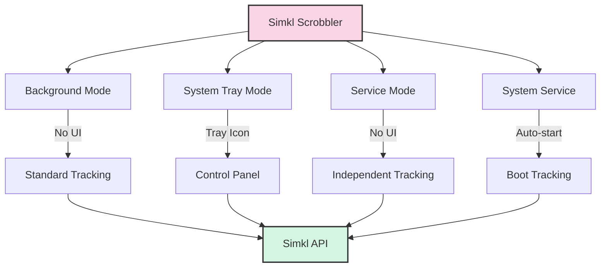

# 🎮 Usage Guide

This guide covers the various ways to use Simkl Scrobbler.

## 📋 Basic Commands

```bash
# Initial setup (only needed once)
simkl-scrobbler init

# Start tracking in foreground mode
simkl-scrobbler start

# Launch in system tray
simkl-scrobbler tray

# Run as a background service
simkl-scrobbler service

# Check service status
simkl-scrobbler service-status

# Process pending offline items
simkl-scrobbler process-backlog

# Show all available commands
simkl-scrobbler --help
```

## 🚀 Run Modes

### 🔄 Background Mode

```bash
simkl-scrobbler start
```

Runs silently in the background. This is the standard way to run the application for regular usage.

### 🖥️ System Tray Mode

```bash
simkl-scrobbler tray
```

Runs as a system tray application, allowing you to:
- Start/stop monitoring
- Process the backlog
- View logs
- Exit the application

### 🔄 Service Mode

```bash
simkl-scrobbler service
```

Runs as a background service with no UI. Useful for headless operation or when you want the application to run independently of user sessions.

### ⚙️ System Service (Auto-start)

```bash
# Install as a system service
simkl-scrobbler install-service

# Uninstall the service
simkl-scrobbler uninstall-service

# Check service status
simkl-scrobbler service-status
```

This installs the application to run automatically when your system starts, with platform-specific implementations:
- Windows: Registry startup entry
- macOS: LaunchAgent
- Linux: systemd user service

## 💻 Command-Line Arguments

```bash
# Show detailed help
simkl-scrobbler --help

# Show application version
simkl-scrobbler --version

# Run with debug logging
simkl-scrobbler start --debug

# Use a specific config file
simkl-scrobbler start --config /path/to/config.env
```

## 📁 Log Files

Check these files for troubleshooting:

```
# Main application log
[APP_DATA_DIR]/kavinthangavel/simkl-scrobbler/simkl_scrobbler.log

# Detailed playback events
[APP_DATA_DIR]/kavinthangavel/simkl-scrobbler/playback_log.jsonl
```

Where `[APP_DATA_DIR]` is platform-specific:
- Windows: `%APPDATA%`
- macOS: `~/Library/Application Support`
- Linux: `~/.local/share`

## 🔧 Environment Variables

You can set these environment variables to customize behavior:

| Variable | Purpose | Default |
|----------|---------|---------|
| `SIMKL_CLIENT_ID` | Custom API client ID | Built-in ID |
| `SIMKL_ACCESS_TOKEN` | Manual access token | Auto-generated |
| `SIMKL_LOG_LEVEL` | Logging verbosity (DEBUG, INFO, etc.) | INFO |
| `SIMKL_POLL_INTERVAL` | Window check frequency (seconds) | 10 |
| `SIMKL_COMPLETION_THRESHOLD` | % to mark as watched | 80 |

## 🔍 Recommended Workflow

1. Run `simkl-scrobbler init` to set up your Simkl account
2. Test with `simkl-scrobbler start` to ensure detection works in background mode
3. For daily use, either:
   - Use `simkl-scrobbler tray` for easy access to controls
   - Install as a service with `simkl-scrobbler install-service` for automatic startup

## 📊 Operation Flow

The following diagram illustrates how the different run modes operate:


