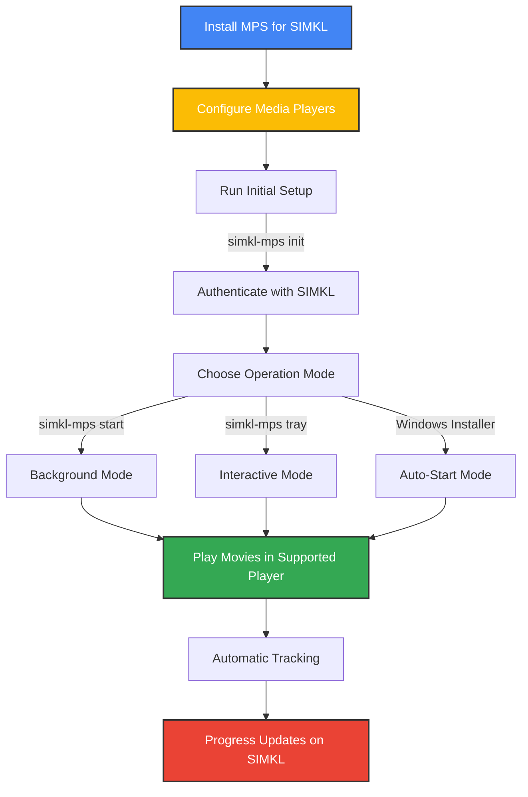
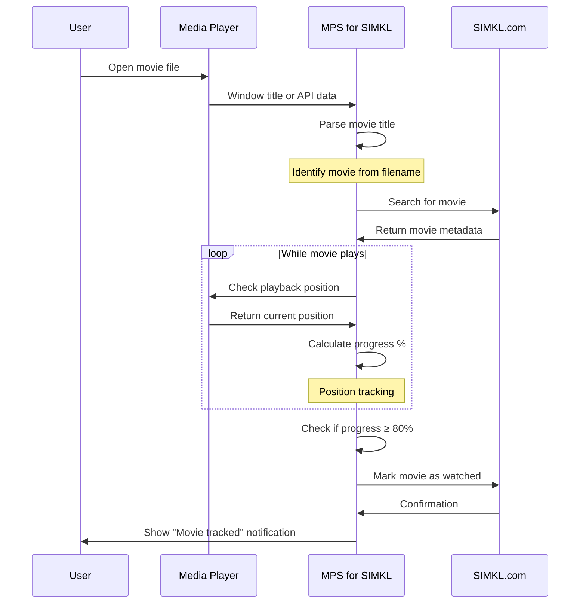
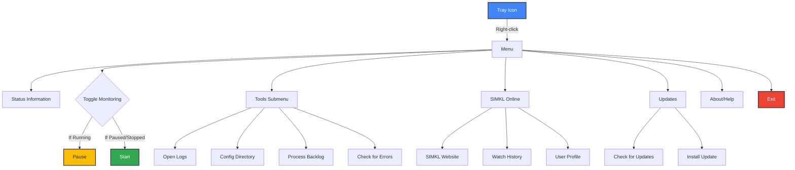

# 🎮 Usage Guide

This comprehensive guide explains how to use Media Player Scrobbler for Simkl to automatically track your movie watching and sync it with your Simkl profile.

> **Important Note**: Currently, the application supports **movie tracking only**. TV show tracking is planned for future updates.

## 📝 Command Reference

| Command                | Shorthand      | Description                        |
|------------------------|---------------|------------------------------------|
| `simkl-mps init`       | `simkl-mps i` | Initial setup and authentication   |
| `simkl-mps start`      | `simkl-mps s` | Start tracking in background mode  |
| `simkl-mps tray`       | `simkl-mps t` | Launch with system tray interface  |
| `simkl-mps stop`       | `simkl-mps x` | Stop the running application       |
| `simkl-mps status`     | `simkl-mps st`| Check if the application is running|
| `simkl-mps version`    | `simkl-mps -v`| Show version information           |
| `simkl-mps clean`      | `simkl-mps c` | Clean old backlog entries          |
| `simkl-mps backlog`    | `simkl-mps b` | Manage offline backlog entries     |
| `simkl-mps --help`     | `simkl-mps -h`| Display help information           |
| `simkl-mps --debug`    | `simkl-mps -d`| Enable debug logging               |

## 🚦 Getting Started



## 🔄 Operation Modes

### Background Mode (Recommended for CLI Users)
Runs silently in the background with minimal UI. Best for daily usage.
```bash
simkl-mps start
```

### Interactive Tray Mode
Shows the system tray icon with real-time status and controls. Good for monitoring and troubleshooting.
```bash
simkl-mps tray
```

### Windows Installer Mode (Recommended for Windows Users)
If you installed using the Windows installer, the application is preconfigured to:
- Run automatically at startup (if selected during installation)
- Appear in the system tray
- Check for updates periodically
- Provide one-click access to functions

### Service/Daemon Mode (Advanced Linux/macOS)
Run as a system service for headless operation.
```bash
# Install service/daemon
simkl-mps daemon install

# Start service
simkl-mps daemon start

# Stop service
simkl-mps daemon stop
```

## 🔍 The Movie Tracking Process



### How Movie Identification Works

1. The application monitors your active media players
2. When a movie is playing, it extracts the title from:
   - Advanced player API data (configured players)
   - Window title (basic tracking)
3. The extracted title is processed and matched against the Simkl database
4. Once identified, playback progress is monitored
5. When you've watched enough (typically 80%), the movie is marked as watched

### Thresholds for Marking Movies as Watched

- **Default threshold**: 80% of movie runtime
- **With runtime data**: Uses actual runtime from Simkl metadata
- **Without runtime data**: Uses an estimated threshold based on playback time

## 🖥️ System Tray Interface

The system tray icon provides instant access to status information and controls.

### Status Icons

| Icon | Status   | Description                  |
|------|----------|------------------------------|
|  | Running | Actively monitoring media players |
|    | Paused  | Monitoring temporarily paused     |
|  | Stopped | Not monitoring                   |
|      | Error   | Authentication or connection error|

### Tray Menu Functions



## 🔔 Notifications

The application shows system notifications for important events:

| Event              | Example                             | Timing                       |
|--------------------|-------------------------------------|------------------------------|
| Authentication     | "Connected to SIMKL account"        | At startup after login       |
| Movie Detection    | "Now tracking: Inception (2010)"    | When movie is identified     |
| Progress Update    | "Inception: 45% complete"           | At significant progress points|
| Scrobbling         | "Inception marked as watched"       | When movie is scrobbled      |
| Errors             | "Unable to connect to SIMKL"        | When errors occur            |
| Updates            | "Update available: v1.2.3"          | When updates are detected    |

## 🔁 Common Usage Workflows

### Windows Workflow (Using the Installer)
1. Install using the Windows installer
2. Select auto-start during installation
3. The application runs automatically at startup
4. Configure your media players ([See Media Players guide](media-players.md))
5. Play movies in your configured media players
6. Movies are automatically tracked and added to your Simkl profile

### Manual Workflow (All Platforms)
1. Start the application manually:
   ```bash
   simkl-mps start
   # or
   simkl-mps tray
   ```
2. Configure your media players
3. Play movies in your configured media players
4. Movies are automatically tracked

### Offline Usage
The application works seamlessly in offline mode:
1. Play movies while offline
2. The application identifies movies and stores them in the backlog
3. When you reconnect to the internet, the backlog is automatically processed
4. All watched movies are synced to your Simkl profile

To manually process the backlog:
```bash
simkl-mps backlog process
```

## 💡 Tips for Best Results

1. **Configure your media players properly** (critical step!)
   - See the [Media Players Configuration Guide](media-players.md)
   - Different players require different setup steps

2. **Use clear, descriptive filenames**
   - Best format: `Movie Title (Year).extension`
   - Example: `Inception (2010).mkv`
   - Including the year significantly improves identification accuracy

3. **For Windows users**:
   - Use the Windows installer for the most seamless experience
   - Enable auto-start for convenience
   - Use the system tray menu for quick access to functions

4. **For optimal performance**:
   - Configure VLC or MPV for the most accurate tracking
   - Keep your media player and the scrobbler updated
   - Process the backlog periodically if offline usage is common

5. **Troubleshooting**:
   - Run with debug logging for detailed information:
     ```bash
     simkl-mps tray --debug
     ```
   - Check logs for error messages and tracking status
   - Verify your media player configuration if tracking is inconsistent

## 🪵 Log Files and Diagnostics

### Log File Locations
- **Windows**: `%APPDATA%\kavinthangavel\simkl-mps\simkl_mps.log`
- **macOS**: `~/Library/Application Support/kavinthangavel/simkl-mps/simkl_mps.log`
- **Linux**: `~/.local/share/kavinthangavel/simkl-mps/simkl_mps.log`

### Key Log Messages
- `Window title detected:` – Movie being monitored
- `Identified movie:` – Successful movie detection
- `Progress:` – Current playback position
- `Marked as watched:` – Successful scrobbling
- `ERROR:` – Problems requiring attention

### Enabling Debug Logging
For more detailed logs, use the `--debug` flag:
```bash
simkl-mps tray --debug
# or
simkl-mps start --debug
```

## 🚦 Performance Expectations

- **Startup time**: 1-3 seconds
- **Memory usage**: 30-60 MB (typical)
- **Movie identification**: 15-30 seconds (typical)
- **Mark as watched (online)**: 2-8 seconds (with good connection)
- **Offline scrobble**: 4-10 seconds to process title, 1-3 seconds to add to backlog

## 📊 Advanced Usage

### Managing the Backlog
```bash
# View current backlog entries
simkl-mps backlog list

# Process all backlog entries
simkl-mps backlog process

# Clean old backlog entries
simkl-mps clean
```

### Command-line Options
```bash
# Start with custom poll interval (in seconds)
simkl-mps start --interval 30

# Enable verbose console output
simkl-mps tray --verbose

# Disable notifications
simkl-mps start --no-notifications

# Show version information
simkl-mps --version
```

### Configuration Reset
If you need to reset authentication or settings:
```bash
# Clear authentication and start fresh
simkl-mps init --reset
```

## 🔎 Future Features

- **TV show tracking** - Coming in future updates
- Enhanced player integration
- User interface improvements
- Additional customization options

For a complete list of planned features, see the [Todo List](todo.md).