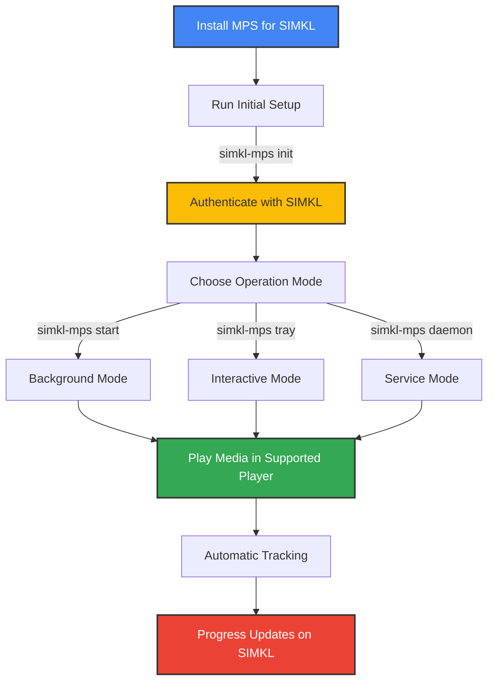
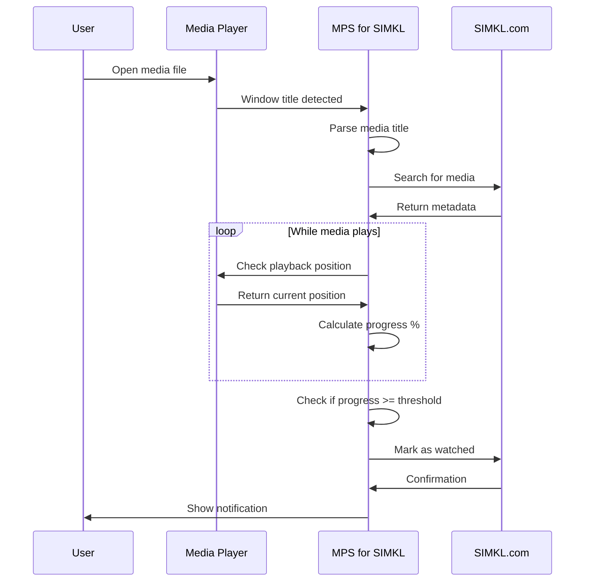
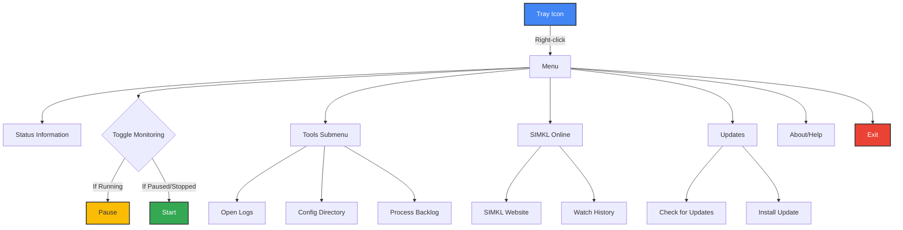

# 🎮 Usage Guide

This guide explains how to use MPS for SIMKL to automatically track your media watching.

## 📝 Quick Command Reference

| Command                | Shorthand      | Description                        |
|------------------------|---------------|------------------------------------|
| `simkl-mps init`       | `simkl-mps i` | Initial setup and authentication   |
| `simkl-mps start`      | `simkl-mps s` | Start tracking in background mode  |
| `simkl-mps tray`       | `simkl-mps t` | Launch with tray interface         |
| `simkl-mps stop`       | `simkl-mps x` | Stop the running application       |
| `simkl-mps status`     | `simkl-mps st`| Check if the app is running        |
| `simkl-mps version`    | `simkl-mps -v`| Show version information           |
| `simkl-mps clean`      | `simkl-mps c` | Clean old backlog entries          |
| `simkl-mps backlog`    | `simkl-mps b` | Manage offline backlog entries     |

---

## 🚦 Performance Notes

- **Movie identification:** 15–30 seconds (typical)
- **Mark as watched (online):** 2–8 seconds (best connection)
- **Offline scrobble:** 4–10 seconds to process title, 1–3 seconds to add to backlog after threshold

---

## 🚦 Getting Started



---

## 🔄 Operation Modes

### Background Mode (Recommended)
Runs in the background with a tray icon. Best for daily use.
```bash
simkl-mps start
```

### Interactive Tray Mode
Shows real-time output and tray icon. Good for setup and troubleshooting.
```bash
simkl-mps tray
```

### Service/Daemon Mode (Linux/macOS)
Run as a system service.
```bash
simkl-mps daemon install
simkl-mps daemon start
```

---

## 📈 Tracking Workflow



---

## 🖥️ System Tray Interface

The tray icon gives quick access to status and controls.

### Status Icons

| Icon | Status   | Description                  |
|------|----------|------------------------------|
|  | Running | Monitoring media players |
|    | Paused  | Monitoring paused        |
|  | Stopped | Not monitoring          |
|      | Error   | An error occurred       |

### Tray Menu Functions



---

## 🔔 Notifications

| Event              | Example                        |
|--------------------|--------------------------------|
| Authentication     | "Connected to SIMKL account"   |
| Media Detection    | "Now tracking: Movie Title"    |
| Progress Update    | "Movie Title: 45% complete"    |
| Scrobbling         | "Movie Title marked as watched"|
| Errors             | "Unable to connect to SIMKL"   |

---

## 🔁 Common Workflows

### First-Time Setup
```bash
simkl-mps init
simkl-mps tray
# Play media to verify detection
simkl-mps start
```

### Daily Usage
- Ensure MPS for SIMKL is running (auto-start or manual)
- Play media in any supported player
- The app will detect, track, and sync automatically

### Offline Usage
- Detection works offline
- Watched content is stored in backlog
- Backlog syncs when online
- Manual: `simkl-mps backlog process`

---

## 💡 Tips and Best Practices

1. Use clear filenames: `Movie Title (2023).mp4`
2. Configure [advanced tracking](media-players.md) for best accuracy
3. Increase poll interval for lower resource use
4. Enable auto-start for convenience
5. Run `simkl-mps clean` to remove old backlog

---

## 🪵 Log Analysis

Log file locations:
- Windows: `%APPDATA%\kavinthangavel\simkl-mps\simkl_mps.log`
- macOS: `~/Library/Application Support/kavinthangavel/simkl-mps/simkl_mps.log`
- Linux: `~/.local/share/kavinthangavel/simkl-mps/simkl_mps.log`

Look for:
- `Window title detected:` – What is being monitored
- `Identified movie:` – Successful detection
- `Progress:` – Playback position
- `Marked as watched:` – Scrobbling success
- `ERROR:` – Problems needing attention