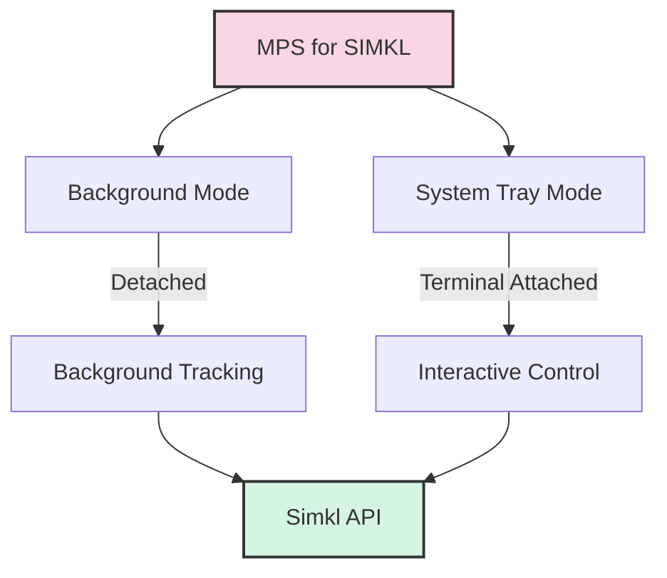

# 🎮 Usage Guide

This guide covers the various ways to use MPS for SIMKL (Media Player Scrobbler for SIMKL).

## 📋 Basic Commands

```bash
# Initial setup (only needed once)
simkl-mps i        # or: simkl-mps init

# Start tracking in background mode
simkl-mps s        # or: simkl-mps start

# Launch in system tray (shows logs)
simkl-mps t        # or: simkl-mps tray

# Show version information
simkl-mps -v       # or: simkl-mps --version
simkl-mps V        # or: simkl-mps version

# Show all available commands
simkl-mps --help
```

> **Note:** The application is displayed as "MPS for SIMKL" in the system tray and other user interfaces, while the command-line tool name remains `simkl-mps`.

## 🚀 Run Modes

### 🔄 Background Mode

```bash
simkl-mps s        # or: simkl-mps start
```

Runs the tray application detached in the background. This is the standard way to run the application for regular usage. You can safely close the terminal after starting.

### 🖥️ System Tray Mode

```bash
simkl-mps t        # or: simkl-mps tray
```

Runs the tray application attached to the current terminal, showing logs. The application will stop when you close the terminal. This mode allows you to:
- Start/stop monitoring
- Process the backlog
- View logs
- Exit the application

## 💻 Command-Line Arguments

```bash
# Show detailed help
simkl-mps --help

# Show version information
simkl-mps -v       # or: simkl-mps --version
simkl-mps V        # or: simkl-mps version

# Run with debug logging
simkl-mps s --debug    # or: simkl-mps start --debug

# Use a specific config file
simkl-mps s --config /path/to/config.env    # or: simkl-mps start --config /path/to/config.env
```

## 📁 Log Files

Check these files for troubleshooting:

```
# Main application log
[APP_DATA_DIR]/kavinthangavel/simkl-mps/media-player-scrobbler-for-simkl.log

# Detailed playback events
[APP_DATA_DIR]/kavinthangavel/simkl-mps/playback_log.jsonl
```

Where `[APP_DATA_DIR]` is platform-specific:
- Windows: `%APPDATA%`
- macOS: `~/Library/Application Support`
- Linux: `~/.local/share`

## 🔧 Environment Variables

You can set these environment variables to customize behavior:

| Variable | Purpose | Default |
|----------|---------|---------|
| `SIMKL_CLIENT_ID` | Custom API client ID | Built-in ID |
| `SIMKL_ACCESS_TOKEN` | Manual access token | Auto-generated |
| `SIMKL_LOG_LEVEL` | Logging verbosity (DEBUG, INFO, etc.) | INFO |
| `SIMKL_POLL_INTERVAL` | Window check frequency (seconds) | 10 |
| `SIMKL_COMPLETION_THRESHOLD` | % to mark as watched | 80 |

## 🔍 Recommended Workflow

1. Run `simkl-mps i` (or `init`) to set up your Simkl account
2. Test with `simkl-mps t` (or `tray`) to ensure detection works and view logs
3. For daily use, run `simkl-mps s` (or `start`) to launch in background mode

## 📊 Operation Flow

The following diagram illustrates how the different run modes operate:

