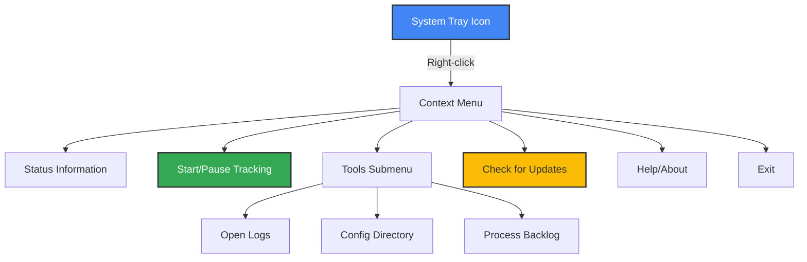

# 🪟 Windows Installation & Configuration Guide

This comprehensive guide provides detailed instructions specifically for Windows users of Media Player Scrobbler for Simkl, focusing on the Windows installer, system integration, and media player configuration.

> **Important Note**: Currently, the application supports **movie tracking only**. TV show tracking is planned for future updates.

## 📥 Windows Installer

The Windows installer provides the most streamlined experience with automatic updates and system integration.

### Download and Installation Process

1. [Download the latest installer](https://github.com/ByteTrix/Media-Player-Scrobbler-for-Simkl/releases/latest)
2. **Right-click** the installer and select **"Run as administrator"** (recommended)
3. Follow the setup wizard:
   - Accept the license agreement
   - Choose your preferred installation location (optional)
   - Select components to install:
     - Desktop shortcut
     - Start menu shortcuts
     - **Auto-start on login** (recommended)
     - **Auto-update checking** (recommended)

### Installer Features

- **All-in-one package**: Includes all dependencies (no separate Python installation required)
- **System integration**: Creates desktop and start menu shortcuts
- **Auto-start capability**: Option to run automatically when Windows starts
- **Auto-update system**: Checks for updates weekly
- **Clean uninstallation**: Properly removes all components

### Post-Installation

After installation completes:
1. The application launches automatically
2. Authenticate with your Simkl account when prompted
3. A system tray icon appears in the notification area
4. **CRITICAL STEP**: Configure your media players for optimal tracking (see below)

## ⚙️ Media Player Configuration on Windows (recommended)

For the best movie tracking experience, configure your preferred media players:
[Media Players](media-players.md)

## 🖥️ Windows System Integration

### System Tray Features

Right-click the system tray icon to access:

- **Status information**: Current monitoring state and connection status
- **Start/Pause Tracking**: Toggle monitoring
- **Tools**: Access to logs, configuration, and backlog management
- **Check for Updates**: Manually check for and install updates
- **Exit**: Close the application

### Windows Auto-Start

If you selected auto-start during installation, the application will launch automatically when you log in to Windows. To change this setting:

1. Right-click the system tray icon
2. Select **Settings**
3. Toggle the **Launch on startup** option

### Windows-Specific File Locations

- **Configuration file**: `%APPDATA%\kavinthangavel\simkl-mps\.simkl_mps.env`
- **Log files**: `%APPDATA%\kavinthangavel\simkl-mps\simkl_mps.log`
- **Backlog database**: `%APPDATA%\kavinthangavel\simkl-mps\backlog.db`

## 🔄 Windows Update System

The Windows installer version includes an automatic update system:

### How Updates Work

1. If auto-check is enabled, the application checks for updates weekly
2. When an update is available, a notification appears
3. Click the update option in the tray menu
4. Your default browser opens and the update downloads automatically
5. Install the Setup
6. The application restarts with the new version

## 🚀 Optimizing for Windows

### Performance Tips

1. **Use the Windows installer** for the best experience
2. Enable **auto-start** for convenience
3. Configure **VLC** or **MCP-HC** for the most accurate tracking
4. Use the **system tray menu** for quick access to functions
5. **Proper filenames** significantly improve movie identification:
   - Best format: `Movie Title (Year).extension`
   - Example: `Inception (2010).mkv`

### Resource Usage

- **Memory**: 30-60 MB (typical)
- **CPU**: Minimal (1-2% during active tracking)
- **Disk**: ~20 MB for installation + small database (~1 MB)
- **Network**: Only when syncing with Simkl

## 🔍 Windows Troubleshooting

### Common Issues

| Issue | Solution |
|-------|----------|
| Installation fails | Run as administrator, check Windows Defender settings |
| Application doesn't start | Check Event Viewer for errors, verify .NET Framework installation |
| Tray icon missing | Check if app is running in Task Manager, restart app |
| VLC connection fails | Verify web interface is enabled and password is correct |
| MPV not detected | Check if socket path in config matches expectations |
| Movie not identified | Use clearer filename, check log for details |

### Checking Logs on Windows

1. Right-click the system tray icon
2. Select **Tools → Open Logs**
3. The log file opens in your default text editor

### Running with Debug Logging

For advanced troubleshooting:
1. Open Command Prompt or PowerShell
2. Navigate to the installation directory
3. Run: `simkl-mps.exe --debug`

## 📲 Uninstallation

To remove the application from your Windows system:

1. Open **Settings → Apps → Apps & features**
2. Find "MPS for SIMKL"
3. Click **Uninstall**
4. Follow the uninstallation wizard
5. Choose whether to remove user data (settings, logs, backlog) ("No" is Recommended)

## 🔔 Final Checklist for Windows Users

1. ✅ Install using the Windows installer
2. ✅ Enable auto-start for convenience
3. ✅ Configure your media players (critical step!)
4. ✅ Use proper filenames for your movies
5. ✅ Play a movie and verify it's detected and tracked
6. ✅ Check your Simkl profile to confirm movies are marked as watched
