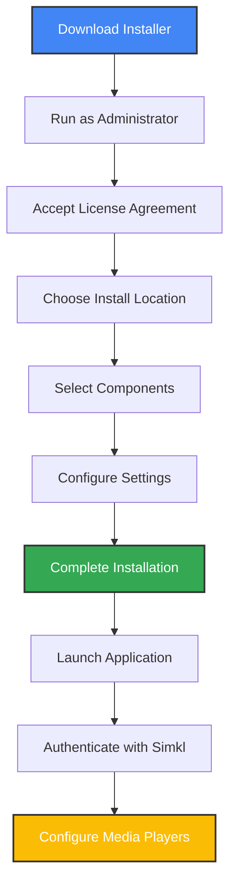
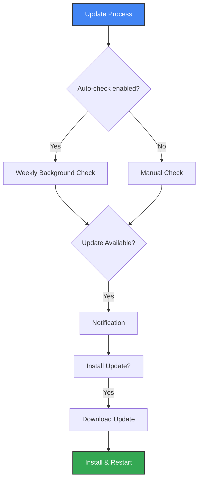

# 🪟 Windows Installation & Configuration Guide

This comprehensive guide provides detailed instructions specifically for Windows users of Media Player Scrobbler for Simkl, focusing on the Windows installer, system integration, and media player configuration.

> **Important Note**: Currently, the application supports **movie tracking only**. TV show tracking is planned for future updates.

## 📥 Windows Installer

The Windows installer provides the most streamlined experience with automatic updates and system integration.

### Download and Installation Process



1. [Download the latest installer](https://github.com/kavinthangavel/media-player-scrobbler-for-simkl/releases/latest)
2. **Right-click** the installer and select **"Run as administrator"** (recommended)
3. Follow the setup wizard:
   - Accept the license agreement
   - Choose your preferred installation location
   - Select components to install:
     - Desktop shortcut
     - Start menu shortcuts
     - **Auto-start on login** (recommended)
     - **Auto-update checking** (recommended)

### Installer Features

- **All-in-one package**: Includes all dependencies (no separate Python installation required)
- **System integration**: Creates desktop and start menu shortcuts
- **Auto-start capability**: Option to run automatically when Windows starts
- **Auto-update system**: Checks for updates weekly
- **Clean uninstallation**: Properly removes all components

### Post-Installation

After installation completes:
1. The application launches automatically
2. Authenticate with your Simkl account when prompted
3. A system tray icon appears in the notification area
4. **CRITICAL STEP**: Configure your media players for optimal tracking (see below)

## ⚙️ Media Player Configuration on Windows

For the best movie tracking experience, configure your preferred media players:

### VLC Media Player (Recommended)

```mermaid
flowchart TD
    A[Open VLC] --> B[Tools → Preferences]
    B --> C[Show Settings: All]
    C --> D[Interface → Main interfaces]
    D --> E[Check 'Web' option]
    E --> F[Interface → Main interfaces → Lua]
    F --> G[Set HTTP Password]
    G --> H[Save & Restart VLC]
    style A fill:#d4f1f9,stroke:#333,stroke-width:2px
    style H fill:#d5f5e3,stroke:#333,stroke-width:2px
```



**Step-by-Step Configuration:**
1. Open VLC Media Player
2. Navigate to **Tools → Preferences**
3. At the bottom left, change **Show settings** to **All**
4. Navigate to **Interface → Main interfaces**
5. Check the box for **Web** to enable the web interface
6. Go to **Interface → Main interfaces → Lua**
7. Set a password in the **Lua HTTP Password** field
8. Click **Save** and restart VLC

### Media Player Classic (MPC-HC/BE)

```mermaid
flowchart TD
    A[Open MPC-HC/BE] --> B[View → Options]
    B --> C[Player → Web Interface]
    C --> D[Enable Web Interface]
    D --> E[Set port to 13579]
    E --> F[OK and Restart]
    style A fill:#d4f1f9,stroke:#333,stroke-width:2px
    style F fill:#d5f5e3,stroke:#333,stroke-width:2px
```



**Configuration Steps:**
1. Open MPC-HC or MPC-BE
2. Navigate to **View → Options**
3. Go to **Player → Web Interface**
4. Check **Listen on port:** and ensure it's set to **13579** (default)
5. Click **OK** and restart MPC

### MPV Media Player

**Configuration Steps:**
1. Navigate to `%APPDATA%\mpv\` (create it if it doesn't exist)
2. Create or edit the `mpv.conf` file
3. Add the following line:
   ```
   input-ipc-server=\\.\pipe\mpvsocket
   ```
4. Save the file and restart MPV

### PotPlayer

**Configuration Steps:**
1. Open PotPlayer
2. Navigate to **Preferences** (F5)
3. Go to **Network → Remote Control**
4. Enable **HTTP control**
5. Set the port to **8080** (or another port of your choice)
6. Click **OK** and restart PotPlayer

## 🖥️ Windows System Integration

### System Tray Features

Right-click the system tray icon to access:


- **Status information**: Current monitoring state and connection status
- **Start/Pause Tracking**: Toggle monitoring
- **Tools**: Access to logs, configuration, and backlog management
- **Check for Updates**: Manually check for and install updates
- **Exit**: Close the application

### Windows Auto-Start

If you selected auto-start during installation, the application will launch automatically when you log in to Windows. To change this setting:

1. Right-click the system tray icon
2. Select **Settings**
3. Toggle the **Launch on startup** option

### Windows-Specific File Locations

- **Configuration file**: `%APPDATA%\kavinthangavel\simkl-mps\.simkl_mps.env`
- **Log files**: `%APPDATA%\kavinthangavel\simkl-mps\simkl_mps.log`
- **Backlog database**: `%APPDATA%\kavinthangavel\simkl-mps\backlog.db`

## 🔄 Windows Update System

The Windows installer version includes an automatic update system:



### How Updates Work

1. If auto-check is enabled, the application checks for updates weekly
2. When an update is available, a notification appears
3. Click the notification or update option in the tray menu
4. The update downloads and installs automatically
5. The application restarts with the new version

### Manual Update Check

1. Right-click the system tray icon
2. Select **Check for Updates**
3. Follow the prompts if an update is available

## 🚀 Optimizing for Windows

### Performance Tips

1. **Use the Windows installer** for the best experience
2. Enable **auto-start** for convenience
3. Configure **VLC** or **MPV** for the most accurate tracking
4. Use the **system tray menu** for quick access to functions
5. **Proper filenames** significantly improve movie identification:
   - Best format: `Movie Title (Year).extension`
   - Example: `Inception (2010).mkv`

### Resource Usage

- **Memory**: 30-60 MB (typical)
- **CPU**: Minimal (1-2% during active tracking)
- **Disk**: ~20 MB for installation + small database (~1 MB)
- **Network**: Only when identifying movies or syncing with Simkl

## 🔍 Windows Troubleshooting

### Common Issues

| Issue | Solution |
|-------|----------|
| Installation fails | Run as administrator, check Windows Defender settings |
| Application doesn't start | Check Event Viewer for errors, verify .NET Framework installation |
| Tray icon missing | Check if app is running in Task Manager, restart app |
| VLC connection fails | Verify web interface is enabled and password is correct |
| MPV not detected | Check if socket path in config matches expectations |
| Movie not identified | Use clearer filename, check log for details |

### Checking Logs on Windows

1. Right-click the system tray icon
2. Select **Tools → Open Logs**
3. The log file opens in your default text editor

### Running with Debug Logging

For advanced troubleshooting:
1. Open Command Prompt or PowerShell
2. Navigate to the installation directory
3. Run: `simkl-mps.exe --debug`

## 📲 Uninstallation

To remove the application from your Windows system:

1. Open **Settings → Apps → Apps & features**
2. Find "Media Player Scrobbler for SIMKL"
3. Click **Uninstall**
4. Follow the uninstallation wizard
5. Choose whether to remove user data (settings, logs, backlog)

## 🔔 Final Checklist for Windows Users

1. ✅ Install using the Windows installer
2. ✅ Enable auto-start for convenience
3. ✅ Configure your media players (critical step!)
4. ✅ Use proper filenames for your movies
5. ✅ Play a movie and verify it's detected and tracked
6. ✅ Check your Simkl profile to confirm movies are marked as watched